# CLAUDE.md

Primary operating system for Claude Code. This document defines the **Universal Agentic Runtime**—the hierarchical architecture where **Command (Intent) → Agent (Autonomy) → Skill (Protocol)**.

---

# PART I: PARADIGM

## 1.1 The Orchestration Runtime

The toolkit operates as an **Orchestration Runtime** optimized for the Claude Code protocol.
- **The Model** is the CPU (Claude, GLM, MiniMax).
- **The Context** is the RAM.
- **The Components (Commands/Agents/Skills)** are the Software.

We program with **Intent**, not scripts. Instead of `for file in files`, instruct: *"Launch 3 code-explorer agents in parallel to audit the `src/` directory."*

---

## 1.2 The Unified Capability Architecture

| Component | Role | Native Mechanic |
|:----------|:-----|:----------------|
| **Skill** | **Atomic Capability** | Auto-discoverable via semantic matching. Can be `user-invocable`, `context: fork`, and `agent: [name]` bound. |
| **Command** | **Orchestrator** | Manages multi-phase workflows by sequencing multiple Skills. |
| **Agent** | **Persona** | Reusable identity/tools that Skills can bind to via `agent: [name]`. |

### Tool Primitives

| Tool | Purpose |
|:-----|:--------|
| `Task` | Spawns subagents with specialized personas |
| `Skill` | Loads skills/invokes commands programmatically |
| `Read` / `Glob` / `Grep` | File system interaction |
| `Write` / `Edit` | File modification |
| `Bash` | Shell command execution |
| `AskUserQuestion` | User interaction during planning |

---

## 1.3 Core Pillars

### Pillar 1: Atomic Independence
Components function standalone—no caller assumptions, no cross-plugin references, no shared state.

**Mercenary Isolation:** Agents MUST NOT reference plugin-specific files. Commands inject context via prompting. Domain expertise lives in Skills, not Agent system prompts.

### Pillar 2: Atomic Capabilities with Hybrid Execution
Skills are active capability units with dual nature: **passive knowledge** (auto-discovered standards) and **active execution** (via `context: fork` or user invocation).

- **Passive Mode:** Skills auto-load when descriptions match user requests.
- **Active Mode:** Skills with `context: fork` run as isolated subagents.

**Constraint:** `AskUserQuestion` FORBIDDEN in skills. If input missing → agent judgment or HANDOFF.md.

**Commands exist for orchestration only** (multi-skill workflows). Never create a Command that wraps a single Skill.

### Pillar 3: Native Delegation
**"Never write in code what can be described in intent."**

| Anti-Pattern | Native Pattern |
|:-------------|:---------------|
| `find . -name "*.ts" -exec grep "todo" {} \;` | "Find all TypeScript files containing TODO comments" |
| Command wrapping single Skill | Forked Skill with `context: fork` |
| "Run find src -name '*.js'" | "Locate source files using filesystem tools" |

**Delegation Flow:**
1. **Atomic task** → Forked Skill (`context: fork`)
2. **Multi-phase workflow** → Command orchestrating multiple Skills
3. **Persona-based reasoning** → Agent-bound Skill (`agent: [name]`)

### Pillar 4: Interface via Intent
**The `description` field is the API.** The Runtime discovers capabilities via semantic matching.

**Description Writing Rules:**
- Place "USE when [CONDITION]" as the **first sentence**
- Use natural language keywords for discovery
- Avoid XML `<example>` blocks in frontmatter (reserved for machine signaling only)

| Avoid | Prefer |
|:------|:-------|
| `<example>...</example>` | Keywords: "audit code", "fix bugs", "deploy app" |
| Buried trigger text | "USE when" as first sentence |
| Vague marketing copy | Action verbs + specific contexts |

**XML Reserved Cases:** Agent discovery (optional), hook signaling (`<promise>`, `<status>`), prompt grouping (`<guidelines>`), high-density data isolation.

### Pillar 5: State-in-Files
Context is ephemeral; files are eternal. Decisions → ADR. Tasks → Status file. If not on disk, it didn't happen.

### Pillar 6: Shared-Nothing Parallelism
Atomic assignments (no dependencies between parallel agents). File locking (parallel agents never edit same file). Synthesis obligation (orchestrator merges outputs).

### Pillar 7: Meta-Synchronization
When working on the toolkit itself, ensure absolute consistency between *defined architecture* (docs/prompts) and *implemented behavior* (code/scripts). Never "do what I say, not what I do."

---

# PART II: COMMAND (Intent Layer)

## 2.1 What Commands Are

Commands are **Reusable Prompt Templates**—Markdown files that instruct the Main Agent for the current turn.

- Use `$ARGUMENTS` to capture user's full natural language input
- `argument-hint: [string]` is for UI documentation only
- Commands orchestrate workflows by instructing the Main Agent

---

## 2.2 Command Types

| Type | Consumer | `disable-model-invocation` | AskUserQuestion |
|:-----|:---------|:---------------------------|:----------------|
| User-Centric | Human only | `true` | Yes |
| Agent-Ready | Specialized Agents | `false` | No |
| Hybrid | Both | `false` | Conditional |

---

## 2.3 The Skill Tool (Recursive Pattern)

Agents invoke Commands via `Skill(/command-name)` or `Skill(/command:*)` for prefix matching.

---

## 2.4 Complex Orchestration Pattern

For complex multi-phase orchestration, follow the pattern in **[docs/GOLD_STANDARD_COMMAND.md](docs/GOLD_STANDARD_COMMAND.md)**.

**Pattern:** Discovery → Exploration (Agents) → Questions → Architecture (Agents) → Implementation → Review (Agents) → Summary

---

# PART III: AGENT (Autonomy Layer)

## 3.1 What Agents Are

Agents are **Specialized Personas** with their own system prompts and optional tool restrictions, launched via the `Task` tool.

- **Agent vs Subagent:** An Agent is the definition (`agents/*.md`); a "Subagent" is the runtime instance spawned via `Task`
- **Model Selection:** `haiku` (speed), `sonnet` (balance), `opus` (logic), or `'inherit'`
- **Tool Restriction:** `tools` field in frontmatter (whitelist). If omitted, inherits ALL tools
- **Permission Mode:** `default`, `acceptEdits`, `dontAsk`, `bypassPermissions`, `plan`, or `ignore`
- **Context Sharing:** Each subagent has its own context window but can access session history (read-only)

---

## 3.2 Agent Permissions

```yaml
---
name: code-reviewer
description: Analyzes code for quality issues
tools: Read, Grep, Glob, Bash
model: sonnet
permissionMode: plan
skills: security-standards
hooks:
  PreToolUse:
    - matcher: "Bash"
      hooks:
        - type: command
          command: "./validate.sh"
---
```

**Critical:** If you omit `tools`, the agent inherits ALL tools including Read, Write, Edit, Bash, AskUserQuestion, Task, Skill, and all MCP tools.

---

## 3.3 Agent Discovery Protocol

Agents are triggered via **semantic description matching**.

```yaml
---
name: security-reviewer
description: |
  USE when auditing code for security vulnerabilities.
  Specializes in OWASP patterns, injection flaws, and authentication issues.
  Keywords: security audit, vulnerability scan, penetration test
tools: Read, Grep, Glob
---
```

---

## 3.4 Delegation Patterns

**The Physics:** Delegation is based on **Context Gravity** and **Attention Dilution**.

> **The 10-File Heuristic:** If a task requires reasoning about >10 files, delegate to preserve Main Thread's attention focus.

### Pattern Selection Matrix

| Metric | Direct | Delegated | Parallel |
|:-------|:-------|:----------|:---------|
| **Files Involved** | 1-5 | 5-20 | 20+ |
| **Duration** | <1 min | 1-5 mins | 5+ mins |
| **User Input** | Required | Forbidden | Forbidden |

---

# PART IV: SKILL (Protocol Layer)

## 4.1 What Skills Are

Skills are **Hybrid Capability Units**—passive knowledge with optional active execution.

| Mode | Trigger | Behavior |
|:-----|:--------|:---------|
| **Passive** | Description matches user request | Standards/guidance loaded into context |
| **Active (Fork)** | `context: fork` set | Runs as isolated subagent |
| **Active (User)** | User types `/skill-name` | Direct invocation |

---

## 4.2 Skill Anatomy

```
skill-name/
├── SKILL.md          # Required: Instructions + Metadata
├── scripts/          # Optional: Executable scripts
├── references/       # Optional: On-demand documentation
└── assets/           # Optional: Templates, data files
```

---

## 4.3 Progressive Disclosure

| Layer | Budget | When Loaded |
|-------|--------|-------------|
| **Metadata** (`name` + `description`) | ~100 tokens | Startup |
| **Instructions** (SKILL.md body) | <5000 tokens | On activation |
| **Resources** (scripts/, references/, assets/) | Unlimited | On-demand |

---

## 4.4 Discovery Tiering Matrix

> [!IMPORTANT]
> The tiers below are **pattern guidance** for writing effective descriptions. Do NOT include `[Tier X: Name]` as a literal prefix.

| Tier | Use Case | Pattern |
|:-----|:---------|:--------|
| **1: High Fidelity** | Complex/fuzzy tasks, LLM capability overlap | `[MODAL] when [CONDITION]. Examples: <example>...` |
| **2: High Gravity** | Safety-critical, governance, mandatory protocols | `[MODAL] USE when [CONDITION].` |
| **3: Utility** | Single-purpose, self-documenting utilities | `{Action Verb} + {Object} + {Purpose}` |

**Selection Rules:**
1. >40% overlap with built-in tools → Tier 1
2. Governance/safety layer → Tier 2
3. Self-documenting name → Tier 3

---

## 4.5 YAML Frontmatter

For complete YAML schema and field reference, see **[docs/SKILL_FRONTMATTER_STANDARD.md](docs/SKILL_FRONTMATTER_STANDARD.md)**.

```yaml
---
name: skill-name          # Required. Max 64 chars, lowercase, hyphens only
description: |            # Required. Follow Discovery Tiering Matrix
  USE when [condition].
  Description text here.
allowed-tools: Read, Edit  # Optional. Comma-delimited pre-approved tools
context: fork             # Optional. Run in isolated sub-agent context
agent: security-reviewer  # Optional. Bind to agent persona when forked
---
```

---

# PART V: RUNTIME MECHANICS

## 5.1 Permission System

Three-level cascading hierarchy:

1. **Main Agent** sets baseline permissions
2. **Subagents** can override `permissionMode` but inherit tool restrictions unless explicitly overridden
3. **Skills** can override both `permissionMode` and `allowed-tools`

| Restriction Type | Used By | Behavior |
|:-----------------|:--------|:---------|
| **`tools`** | **Agents** | Whitelist of what agent CAN use (hard boundary) |
| **`allowed-tools`** | **Commands/Skills** | Runtime restriction during execution |

### Permission Modes

| Mode | Behavior | Security |
|:-----|:---------|:---------|
| `default` | Prompts for each tool | High |
| `acceptEdits` | Auto-approves file operations | Medium |
| `plan` | Read-only analysis | High |
| `dontAsk` | Auto-deny unless pre-approved | High |
| `bypassPermissions` | All tools approved | **Very Low** |
| `ignore` | Ignores permission system | **None** |

---

## 5.2 Hooks (Governance)

Hooks are the **Immune System**—interception, safety, context injection. Never heavy work.

| Hook | Trigger |
|:-----|:--------|
| `SessionStart` | New session begins |
| `UserPromptSubmit` | Before prompt processing |
| `PreToolUse` | Before tool execution |
| `PermissionRequest` | Permission dialog shown |
| `PostToolUse` | After tool success |
| `Notification` | System notifications |
| `Stop` | Main agent finishes |
| `SubagentStop` | After task completion |
| `PreCompact` | Before context compaction |
| `SessionEnd` | Session ends |

**Safety Standards:**
- **Portability:** ALWAYS use `${CLAUDE_PLUGIN_ROOT}` for script paths
- **Input Hygiene:** Read stdin as JSON, validate with `jq`, quote ALL variables
- **Output Protocol:** Return valid JSON. Exit `0` for success, `2` for blocking errors

For implementation recipes and validation scripts, see **[docs/HOOKS_OVERVIEW.md](docs/HOOKS_OVERVIEW.md)**.

---

## 5.3 MCP Integration

Plugins connect to external services via the **Model Context Protocol (MCP)**.

**Security:** Restrict by URL pattern, audit third-party servers, use OAuth tokens. Never use wildcard `*`.

For MCP configuration examples, see **[docs/IMPLEMENTATION-GUIDE.md](docs/IMPLEMENTATION-GUIDE.md#mcp-configuration)**.

---

## 5.4 Token Budget & Context Gravity

| Component | Budget |
|:----------|:-------|
| Command description | <200 tokens |
| Agent description | <500 tokens |
| Skill description | <200 tokens |
| SKILL.md body | <5000 tokens |
| Reference files | Unlimited |

**Context Gravity Rule:** If phase requires >5 source files → use Delegated pattern.

---

## 5.5 Interaction Graph

```mermaid
graph TB
    User["👤 User"]
    MainAgent["🤖 Main Agent<br/>(Claude)"]
    Commands["📋 Commands<br/>(Orchestrator)"]
    ForkedSkills["🔧 Forked Skills<br/>(context: fork)"]
    Skills["📚 Skills<br/>(Atomic Capabilities)"]
    Agents["👥 Agents<br/>(Personas)"]
    Tools["🛠️ Tools<br/>(Read, Write, Bash, etc.)"]
    Hooks["🪝 Hooks<br/>(Event Interception)"]
    MCP["🔌 MCP Servers<br/>(External Services)"]

    User -->|"Invokes (/skill)"| ForkedSkills
    User -->|"Invokes (/command)"| Commands
    User -->|"Natural Language"| MainAgent

    Commands -->|"Orchestrates"| Skills
    Commands -->|"Injects Instructions"| MainAgent

    MainAgent -->|"Auto-loads via description"| Skills
    MainAgent -->|"Uses"| Tools
    MainAgent -->|"Calls"| MCP

    Skills -->|"context: fork"| ForkedSkills
    ForkedSkills -.->|"Binds Persona"| Agents
    ForkedSkills -->|"Executes"| Tools
    Skills -->|"Auto-discoverable"| MainAgent

    Tools -->|"Triggers"| Hooks
    Hooks -.->|"Blocks/Warns/Injects"| MainAgent
```



---

## 5.6 Runtime Constraints (Endpoint Awareness)

The toolkit supports multiple agentic endpoints. Adjust behavior based on the active runtime:

| Endpoint | Optimization Strategy |
|:---------|:----------------------|
| **Anthropic (Claude)** | Full capability: large context (200k+), native `Task`/`Skill` tools |
| **Zai (GLM-4.x)** | Leverage native function calling. Vision tasks use `GLM-4.6V`. |
| **Minimax (M2)** | Prioritize **Parallel Agent Pattern** due to fast inference. Excellent for multi-file context edits. |

**Behavioral Adaptation Rules:**
1. If context window is limited → increase delegation frequency
2. If vision model available → use skill-based image analysis
3. If inference is fast → prefer parallel agent spawning over sequential

For endpoint-specific technical details and proxy configuration, see **[docs/ARCHITECTURE_REFERENCE.md](docs/ARCHITECTURE_REFERENCE.md)**.

---

# PART VI: MAINTENANCE

## 6.1 Project Hygiene

- **Never create temporary markdown reports** - Output findings directly in responses
- **Clean up after operations** - Remove temp files, caches, build artifacts
- **Move to .attic instead of deleting** - When removing code/files during refactoring
- **Run toolkit validation after changes** - `./scripts/toolkit-lint.sh`

IMPORTANT: If you have access to claude-code-guide agent, use it PROACTIVELY. Otherwise, refer to **[docs/RESEARCH_SOURCES.md](docs/RESEARCH_SOURCES.md)**.

---

## 6.2 File Path Standards

### Within Skills
```
✅ assets/templates/document.md
✅ references/format-guide.md
```

### Cross-Component
```
✅ "from the project-strategy skill"
❌ ../../../other-skill/assets/template.md
```

---

## 6.3 Forbidden Patterns

<forbidden_pattern>
**Caller Assumption:** Agent assumes specific command invoked it.
**Fix:** "You have been tasked with X" not "Called by /command".
</forbidden_pattern>

<forbidden_pattern>
**Command-Only Logic:** Business logic only in Command, not Skill.
**Fix:** Move logic to Skill. Command references, Agent reads.
</forbidden_pattern>

<forbidden_pattern>
**Cross-Skill Coupling:** Skill A references Skill B via relative path.
**Fix:** Self-contained skills. Use natural language: "from the planning skill".
</forbidden_pattern>

<forbidden_pattern>
**Stop-and-Wait:** Pausing for human input during execution.
**Fix:** Uninterrupted Flow. HANDOFF.md for blockers only.
</forbidden_pattern>

<forbidden_pattern>
**Direct Bloat:** Using Direct (Inline) when context >70% full.
**Fix:** Delegate to Agent to preserve main context.
</forbidden_pattern>

<forbidden_pattern>
**Over-Prescription:** Micromanaging tool usage ("run ls then grep").
**Fix:** Goal-oriented: "Find the controller".
</forbidden_pattern>

<forbidden_pattern>
**Hardcoded Paths:** Absolute or exit-relative paths in skills.
**Fix:** Relative from skill root or natural language for cross-component.
</forbidden_pattern>

<forbidden_pattern>
**Environment-Specific Coupling:** Hardcoding `model` or `permissionMode` when configurable.
**Fix:** Use environment variables or settings files for environment-specific values.
</forbidden_pattern>

<forbidden_pattern>
**Redundant Defaults:** Specifying default values in frontmatter (e.g., `user-invocable: true`).
**Fix:** Omit default values. Only specify if deviating.
</forbidden_pattern>

<forbidden_pattern>
**Buried Trigger:** Placing general description text BEFORE "USE when...".
**Fix:** "USE when" must be the very first sentence.
</forbidden_pattern>

---

## 6.4 Glue Code Detection

**The 10-Line Rule:** If glue code exceeds 10 lines, it's an anti-pattern.

| Component Type | Acceptable | Red Flag |
|:---------------|:-----------|:---------|
| Command Wrapper | <10 lines | >10 lines |
| Skill Wrapper | <5 lines | >10 lines |
| Agent Pass-through | <5 lines | >10 lines |

**Refactoring:** Collapse layers, inline standards, merge overlapping commands.

---

## 6.5 The .cattoolkit Root

All runtime artifacts stored in `.cattoolkit/`:
- **Session State**: `.cattoolkit/context/`
- **Project Management**: `.cattoolkit/planning/`

---

# Documentation References

## Core Specifications
- **[docs/SKILL_FRONTMATTER_STANDARD.md](docs/SKILL_FRONTMATTER_STANDARD.md)** - Technical YAML schema

## Implementation & Recipes
- **[docs/IMPLEMENTATION-GUIDE.md](docs/IMPLEMENTATION-GUIDE.md)** - Validation scripts, MCP configuration
- **[docs/COMMAND-OVERVIEW.md](docs/COMMAND-OVERVIEW.md)** - Command YAML recipes
- **[docs/HOOKS_OVERVIEW.md](docs/HOOKS_OVERVIEW.md)** - Hook I/O protocol and validation scripts
- **[docs/ARCHITECTURE_REFERENCE.md](docs/ARCHITECTURE_REFERENCE.md)** - Endpoint proxy configuration and API details

## Reference
- **[docs/GOLD_STANDARD_COMMAND.md](docs/GOLD_STANDARD_COMMAND.md)** - Full-text command example
- **[README.md](README.md)** - Installation and marketplace
