# CLAUDE.md

Primary operating system for Claude Code. This document defines the **Universal Agentic Runtime**—a hierarchical architecture where **Command (Intent) → Agent (Autonomy) → Skill (Protocol)**. This architecture is optimized for both official (Anthropic) and unofficial (Zai, Minimax) endpoints.

---

# PART I: PARADIGM

## 1.1 The Orchestration Runtime

The toolkit operates as an **Orchestration Runtime**. It is agnostic to the underlying endpoint (Official or Unofficial) but remains **Claude Code Centric** in its protocol.
- **The Model** is the CPU (Claude, GLM, MiniMax).
- **The Context** is the RAM.
- **The Components (Commands/Agents/Skills)** are the Software.

### Natural Language Orchestration
We do not program Claude with loops or scripts. We program with **Intent**.
> **The Parallel Paradigm:** Instead of scripting `for file in files`, instruct:
> *"Launch 3 code-explorer agents in parallel to audit the `src/` directory."*

The Runtime handles concurrency natively via the `Task` tool. Use **Declarative Orchestration** over Imperative Scripting.

---

## 1.2 The Unified Capability Architecture

The architecture centers on **Skills as atomic units of work** with Commands and Agents serving as composition mechanisms:

| Component | Role | Native Mechanic |
|:----------|:-----|:----------------|
| **Skill** | **Atomic Capability** | Auto-discoverable via semantic matching. Can be `user-invocable`, `context: fork`, and `agent: [name]` bound. |
| **Command** | **Orchestrator** | Manages multi-phase workflows by sequencing multiple Skills. |
| **Agent** | **Persona** | Reusable identity/tools that Skills can bind to via `agent: [name]`. |

> **The New Paradigm:**
> - Skills **execute** (atomic work units with Triggers + Execution + Context)
> - Commands **orchestrate** (multi-skill workflows)
> - Agents **provide** (reusable personas/toolsets for Skills)

### Tool Primitives

These native tools drive the architecture:

| Tool | Purpose |
|:-----|:--------|
| `Task` | Spawns subagents with specialized personas |
| `Skill` | Loads skills/invokes commands programmatically |
| `Read` / `Glob` / `Grep` | File system interaction |
| `Write` / `Edit` | File modification |
| `Bash` | Shell command execution |
| `AskUserQuestion` | User interaction during planning |

---

## 1.3 Core Laws

### Law 1: Atomic Independence
Components function standalone. Synergy is a side effect.
- **Agent Sovereignty:** No caller dependency. Self-sufficient discovery.
- **Skill Universality:** Human-readable. No hidden logic. Direct access.
- **Zero-Shared-State:** No cross-plugin file references.

**Mercenary Isolation:** Agents must be **mercenary**—never assume they are part of a specific command.
- **Caller Independence:** Agents MUST NOT reference plugin-specific files in system prompts
- **Context via Prompting:** Commands inject content via natural language prompts
- **Eternal Skills:** Commands are transient; Skills are eternal. Domain expertise lives in Skills, not Agent system prompts.

### Law 2: The Law of Atomic Capabilities
**Eliminate Glue Code.** A Skill that defines its own context (`context: fork`) and is user-invocable requires NO Command wrapper.

Skills are now **active atomic capability units** that execute independently:
- **Forked Skills:** Use `context: fork` to run in isolation via **Recursive Agentic Delegation**.
- **User-Invocable Skills:** Appears in slash commands by default (set `user-invocable: false` only to hide)
- **Agent-Bound Skills:** Use `agent: [name]` to bind to reusable personas

**Commands are for orchestration only** (multi-skill workflows). Never create a Command that wraps a single Skill—this is pure glue code.

### Law 3: Native Delegation
**"Never write in code what can be described in intent."**
Delegate atomic tasks to Forked Skills, complex workflows to Commands.

| Anti-Pattern | Native Pattern |
|:-------------|:---------------|
| `find . -name "*.ts" -exec grep "todo" {} \;` | "Find all TypeScript files containing TODO comments" |
| Command wrapping single Skill (`Task(...)`) | Forked Skill with `context: fork` |
| Step-by-step tool micromanagement | Goal-oriented: "Audit security in src/" |

**Primary Delegation Flow:**
1. **Atomic task** → Forked Skill (`context: fork`)
2. **Multi-phase workflow** → Command orchestrating multiple Skills
3. **Persona-based reasoning** → Agent-bound Skill (`agent: [name]`)

### Law 4: Law of Description
**"The `description` field is the API."**
The Runtime discovers capabilities via semantic matching of descriptions.

Use natural language keywords for Semantic Discovery. Avoid XML `<example>` blocks in frontmatter.

| Avoid | Prefer |
|:------|:-------|
| `<example>...</example>` | Keywords: "audit code", "fix bugs", "deploy app" |
| XML boilerplate | Plain language descriptions |
| Structured examples | Natural triggers ("Use when...") |

### Law 5: State-in-Files
Context is ephemeral; files are eternal. Decisions → ADR. Tasks → Status file. If not on disk, it didn't happen.

### Law 6: Shared-Nothing Parallelism
- Atomic assignments (no dependencies between parallel agents)
- File locking (parallel agents never edit same file)
- Synthesis obligation (orchestrator merges outputs)

### Law 7: Hybrid Skills (Passive Knowledge, Active Execution)
Skills have a dual nature: **passive knowledge** (auto-discovered standards) and **active execution** (via `context: fork` or user invocation).

- **Passive Mode:** Skills auto-load when descriptions match user requests. They provide guidance without executing.
- **Active Mode:** Skills with `context: fork` run as isolated subagents. User-invocable skills execute when typed `/skill-name`.

**Constraint:** `AskUserQuestion` FORBIDDEN in skills. If input missing → agent judgment or HANDOFF.md.

### Law 8: Native Capabilities
Trust the model. Declarative over procedural. Universal over specific.

| Avoid | Prefer |
|:------|:-------|
| "Check package.json, then requirements.txt" | "Identify dependency management system" |
| "Run find src -name '*.js'" | "Locate source files using filesystem tools" |
| "Execute these grep commands: ..." | "Search for authentication patterns" |
| "Use the Read tool on path/to/file.ts" | "Read the config file in the src folder" |

### Law 9: XML Reserved for Machine Signaling
XML tags are reserved for **Machine Reliability** in specific cases only.

| Use Case | Status | Tags | Reason |
|:---------|:-------|:-----|:-------|
| **Agent Discovery** | **Optional** | `<example>`, `<commentary>` | Can help with complex agent selection, but description matching is primary. |
| **Hook Signaling** | **Allowed** | `<promise>`, `<status>` | Hooks use regex to extract signals from output. |
| **Prompt Grouping** | **Optional** | `<guidelines>`, `<rules>` | Helps the Model separate distinct rule sets. |
| **Data Isolation** | **Caution** | `<data>`, `<raw>` | Only for high-density (>100 lines) unstructured data. |

**Use Markdown** for all other prompt structure. Natural language and headers are preferred.

### Law 10: Meta-Synchronization
**When working on the toolkit itself (Meta-Tooling), ensure absolute consistency between the *defined architecture* (docs/prompts) and the *implemented behavior* (code/scripts).**

Never allow the system to "do what I say, not what I do"—if a standard is written, the implementation must rigorously obey it.

| Check | Requirement |
|:------|:------------|
| **Docs → Code** | Every documented pattern must have a working implementation |
| **Code → Docs** | Every implementation must be documented |
| **Prompt → Behavior** | Agent prompts must match actual agent behavior |
| **Standard → Compliance** | If a rule exists in CLAUDE.md, all components must follow it |

---

# PART II: COMMAND (Intent Layer)

## 2.1 What Commands Are

Commands are **Reusable Prompt Templates**—Markdown files that instruct the Main Agent for the current turn. They are instructions FOR Claude, not messages TO the user.

**Key Principles:**
- Use `$ARGUMENTS` to capture the user's full natural language input
- `argument-hint: [string]` is for UI documentation only (not parsed)
- Commands orchestrate workflows by instructing the Main Agent

---

## 2.2 Command Types

Commands work with both humans and AI agents using natural language:

| Type | Consumer | `disable-model-invocation` | AskUserQuestion |
|:-----|:---------|:---------------------------|:----------------|
| User-Centric | Human only | `true` | Yes |
| Agent-Ready | Specialized Agents | `false` | No |
| Hybrid | Both | `false` | Conditional |

---

## 2.4 The Skill Tool (Recursive Pattern)

Agents can invoke Commands via the `Skill` tool. This transforms the Command Suite into a **Standard Library** for Agents.

- An Agent handling a feature can call `/commit` to save its work.
- An Agent debugging can call `/test` to verify.

**Syntax:** Agents can invoke Commands via the `Skill` tool using `Skill(/command-name)` for exact matches or `Skill(/command:*)` for prefix matching with arguments. Arguments are passed using the command's `$ARGUMENTS` placeholder.

### 2.5 Gold Standard: Complex Orchestration Pattern

The **7-Phase Feature Development Workflow** demonstrates ideal orchestration for complex multi-phase commands.

> **Full Specification:** [docs/GOLD_STANDARD_COMMAND.md](docs/GOLD_STANDARD_COMMAND.md)

**Pattern:** Discovery → Exploration (Agents) → Questions → Architecture (Agents) → Implementation → Review (Agents) → Summary

**Core Principles:**
- **Understand before acting:** Read and comprehend existing code patterns first.
- **Ask clarifying questions:** Identify ambiguities early (Phase 3 only).
- **Delegate to agents:** Use parallel agents for exploration, architecture, and review.

---

# PART III: AGENT (Autonomy Layer)

## 3.1 What Agents Are

Agents are **Specialized Personas** with their own system prompts and optional tool restrictions, launched via the `Task` tool.

**Key Concepts:**
- **Agent vs Subagent:** An Agent is the definition (`agents/*.md`); a "Subagent" is the runtime instance spawned via `Task` tool
- **Model Selection:** Agents can use `haiku` (speed), `sonnet` (balance), `opus` (logic), or `'inherit'` to use the main conversation's model
- **Tool Restriction:** Defined via `tools` field in frontmatter (whitelist). If omitted, agents inherit ALL tools from the main thread
- **Permission Mode:** Controls how the agent handles permission requests: `default`, `acceptEdits`, `dontAsk`, `bypassPermissions`, `plan`, or `ignore`
- **Context Sharing:** Each subagent operates in its own separate context window. They can access session conversation history (read-only) but have their own specialized system prompt. Provide exhaustive context when spawning.
- **Lifecycle:** `SubagentStop` hook triggers when a subagent completes

---

## 3.2 Agent Sovereignty (The Task Tool)

The `Task` tool is the primitive used to spawn subagents.

- **Mechanism:** Commands do not spawn agents directly; they instruct the Main Agent to use the `Task` tool.
- **Invocation:** The Main Agent interprets the Command's natural language instruction (e.g., "Launch the code-reviewer agent...") and invokes the `Task` tool to spawn the requested agent.
- **Why:** This maintains the "Command as Prompt" architecture while enabling agentic behavior.

### Agent Permissions

```yaml
---
name: code-reviewer
description: Analyzes code for quality issues
tools: Read, Grep, Glob, Bash  # Only these tools available
model: sonnet  # Optional: model to use (sonnet, opus, haiku, or 'inherit')
permissionMode: plan  # Optional: permission handling (default, acceptEdits, dontAsk, bypassPermissions, plan, ignore)
skills: security-standards  # Optional: skills to auto-load
hooks:  # Optional: component-scoped hooks
  PreToolUse:
    - matcher: "Bash"
      hooks:
        - type: command
          command: "./validate.sh"
---

# Omitting tools field = inherits ALL tools from main thread
```

**Critical Rule:** If you omit the `tools` field, the agent inherits ALL tools including Read, Write, Edit, Bash, AskUserQuestion, Task, Skill, and all MCP tools. The agent field supports: `name`, `description`, `tools`, `model`, `permissionMode`, `skills`, and `hooks`.

---

## 3.3 Agent Discovery Protocol

Agents are triggered via **semantic description matching**. Claude Code proactively delegates tasks based on the `description` field.

**Best Practice Format:**
```yaml
---
name: security-reviewer
description: |
  USE when auditing code for security vulnerabilities.
  Specializes in OWASP patterns, injection flaws, and authentication issues.
  Keywords: security audit, vulnerability scan, penetration test
tools: Read, Grep, Glob
---
```

**Discovery relies on:**
- Clear description of **when** to use the agent
- Keywords matching common user intents
- Specific capability statements

> Description-based semantic matching is the primary discovery mechanism. XML `<example>` blocks are optional and only useful for complex disambiguation.

---

## 3.4 Delegation Patterns

**The Physics:** The decision to delegate is based on **Context Gravity** and **Attention Dilution**.

> **The 10-File Heuristic:** If a task requires reasoning about >10 files, it **SHOULD** move to a Delegated Agent to protect the Main Thread's attention focus.

### Pattern 1: Direct (Inline)
**Composition:** `Command + Skill`
- **Use Case:** "Fix this specific function." (Context < 30%)
- **Interaction:** High (Chatty).
- **Context:** Shared with User.

### Pattern 2: Delegated (Task)
**Composition:** `Command → Task → Agent`
- **Use Case:** "Refactor the Auth module." (Context > 50% or >10 files)
- **Interaction:** Autonomous (Fire & Await Report).
- **Context:** Shares session history but uses specialized persona.
- **Note:** Specialized Agents are **Transparent Subprocesses**, not black boxes. Their thoughts and tool uses are visible in logs.

### Pattern 3: Parallel (Multi-Task)
**Composition:** `Command → Task(A), Task(B), Task(C)`
- **Pattern:** Launch 3-4 agents simultaneously via the `Task` tool to handle complexity.
- **Map:** Command splits task ("Launch 3 agents in parallel to audit src/, tests/, and docs/").
- **Execute:** Subagents run in parallel, using their specialized instructions.
- **Reduce:** The Main Agent synthesizes atomic reports into a final answer.

### Pattern Selection Matrix

| Metric | Direct | Delegated | Parallel |
|:-------|:-------|:----------|:---------|
| **Files Involved** | 1-5 | 5-20 | 20+ |
| **Duration** | <1 min | 1-5 mins | 5+ mins |
| **User Input** | Required | Forbidden | Forbidden |
| **Context State** | Shared | Spec. Persona | Multi-Persona |

---

# PART IV: SKILL (Protocol Layer)

## 4.1 What Skills Are

Skills are **Hybrid Capability Units**—they combine passive knowledge with optional active execution.

| Mode | Trigger | Behavior |
|:-----|:--------|:---------|
| **Passive** | Description matches user request | Standards/guidance loaded into context |
| **Active (Fork)** | `context: fork` set | Runs as isolated subagent with own context |
| **Active (User)** | User types `/skill-name` | Direct invocation, appears in slash menu |

**Key Principle:** Skills provide knowledge. With `context: fork`, they also execute autonomously.

---

## 4.2 Skill Anatomy

### Directory Structure
```
skill-name/
├── SKILL.md          # Required: Instructions + Metadata
├── scripts/          # Optional: Executable scripts
├── references/       # Optional: On-demand documentation
└── assets/           # Optional: Templates, data files
```

---

## 4.3 Progressive Disclosure

Skills use a **3-level loading hierarchy** to minimize context usage:

| Layer | Budget | When Loaded |
|-------|--------|-------------|
| **Metadata** (`name` + `description`) | ~100 tokens | Startup |
| **Instructions** (SKILL.md body) | <5000 tokens | On activation (description match) |
| **Resources** (scripts/, references/, assets/) | Unlimited | On-demand when referenced |

**Resource Types:**
- `references/` - Text loaded into context (API docs, standards)
- `assets/` - Files used in output (templates, images)
- `scripts/` - Executed via `Bash` without being read into context (infinite token budget for procedural logic)

---

## 4.4 Writing Style Requirements

1.  **Imperative/Infinitive Form:** Write SKILL.md body using verb-first instructions.
    -   ✅ Correct: "Verify indentation using 2-space standard."
    -   ❌ Incorrect: "You should check the indentation."
2.  **Third-Person Description:** The YAML `description` determines when the skill is loaded.
    -   ✅ Correct: "This skill should be used when..."
    -   ❌ Incorrect: "Use this skill when..."

---

## 4.6 YAML Frontmatter

```yaml
---
name: skill-name          # Required. Max 64 chars, lowercase, hyphens only
description: |            # Required. Follow Discovery Tiering Matrix
  Description text here
allowed-tools: Read, Edit  # Optional. Comma-delimited pre-approved tools
context: fork             # Optional. Run in isolated sub-agent context
agent: security-reviewer  # Optional. Bind to agent persona when forked
# user-invocable: false   # Optional. Set to false to hide from slash menu (defaults to true)
disable-model-invocation: false  # Optional. Block Skill tool invocation
hooks:                    # Optional. Skill-scoped hooks
  PreToolUse:
    - matcher: "Bash"
      hooks:
        - type: command
          command: "./validate.sh"
---
```

---

## 4.7 Security & Execution

Scripts must be self-contained, include error messages, and handle edge cases. Validate all inputs. Run in isolated environments when possible.

---

# PART V: RUNTIME MECHANICS

## 5.1 Permission System

Claude Code implements a **defense-in-depth permission model** with two primary restriction mechanisms:

| Restriction Type | Used By | Syntax | Behavior |
|:-----------------|:--------|:-------|:---------|
| **`tools`** | **Agents** | `tools: Read, Grep, Bash` | Defines what tools agent CAN use (whitelist). Hard boundary. |
| **`allowed-tools`** | **Commands/Skills** | `allowed-tools: [Read, Grep]` | Restricts tools DURING execution (runtime restriction). |

**Key Distinction:**
- **Agent Whitelist (`tools`):** Defines the hard boundary of what an Agent can ever do. If omitted, agents inherit ALL tools.
- **Execution Restriction (`allowed-tools`):** Restricts the toolset during a specific Command or Skill run.
- **Inheritance:** Subagents inherit the *intersection* of their definition and the parent's current restrictions.

### Permission Modes

| Mode | Behavior | Use Case | Security |
|:-----|:---------|:---------|:---------|
| **`default`** | Prompts for each tool | Development | High |
| **`acceptEdits`** | Auto-approves file operations | Code editing | Medium |
| **`plan`** | Read-only analysis | Code review | High |
| **`dontAsk`** | Auto-deny unless pre-approved | CI/CD | High |
| **`bypassPermissions`** | All tools approved | Trusted environments | **Very Low** |
| **`ignore`** | Ignores permission system completely | Advanced users only | **None** |

### Permission Inheritance

Permission inheritance follows a **cascading hierarchy**:
1. **Main Agent** sets baseline permissions
2. **Subagents** can override `permissionMode` but inherit tool restrictions unless explicitly overridden
3. **Skills** can override both `permissionMode` and `allowed-tools`

### Fine-Grained Tool Permissions

```yaml
# Safe pattern: Specific commands with wildcard patterns
allowed-tools: [
  Bash(git add:*),      # Allow git add with any arguments
  Bash(git status:*),   # Allow git status with any arguments
  Bash(npm test:*),     # Allow npm test with any arguments
  Read,                 # Allow all Read operations
  Grep                  # Allow all Grep operations
]

# Dangerous pattern to avoid
disallowed-tools: [
  Bash(rm *),          # Block dangerous commands
  Bash(sudo *),
  Edit                 # Block modifications when needed
]
```

**Critical Security Rules:**
- **NEVER omit `tools` field** - agents inherit ALL tools if omitted
- **Use whitelist patterns** - specify exact commands when possible
- **Block dangerous operations** - explicitly restrict `rm`, `sudo`, `chmod`

---

## 5.2 Hooks (Governance)

Hooks are the **Immune System**—interception, safety, context injection. Never heavy work.

| Hook | Trigger | Use Case |
|:-----|:--------|:---------|
| `SessionStart` | New session begins | Initial context setup |
| `UserPromptSubmit` | Before prompt processing | Auto-activate skills, inject context |
| `PreToolUse` | Before tool execution | Block risky ops, modify inputs |
| `PermissionRequest` | Permission dialog shown | Permission handling |
| `PostToolUse` | After tool success | Run linters, formatters |
| `Notification` | System notifications | External alerting/logging |
| `Stop` | Main agent finishes | Final cleanup |
| `SubagentStop` | After task completion | Synthesis, teardown |
| `PreCompact` | Before context compaction | Protect critical history |
| `SessionEnd` | Session ends | Final state cleanup |

### Hook Safety Standards
- **Portability:** ALWAYS use `${CLAUDE_PLUGIN_ROOT}` for script paths. Never hardcode absolute paths.
- **Input Hygiene:** Command hooks MUST read stdin as JSON, validate inputs using `jq`, and quote ALL variables.
- **Output Protocol:** Return valid JSON (`continue`, `systemMessage`). Use Exit Code `0` for success, `2` for blocking errors.
- **Prompt First:** Prefer Prompt-Based hooks for logic requiring reasoning; reserve Command hooks for performance/determinism.
- **Component-Scoped Hooks:** Skills, Agents, and Slash Commands can define hooks scoped to their lifecycle using frontmatter. These support only `PreToolUse`, `PostToolUse`, and `Stop` events. Global hooks (in hooks.json) support all events.

---

## 5.3 MCP Integration

Plugins connect to external services (databases, APIs, browsers) via the **Model Context Protocol (MCP)**.
- **Configuration:** Managed via `.claude-plugin/plugin.json` in the plugin root.
- **Discovery:** Tools provided by MCP servers are automatically discovered by Claude when the plugin is active.
- **Scopes:** MCP servers can be configured at local, project, or user level.

### MCP Security

```yaml
# ✅ Good: Specific domain restrictions
allowedMcpServers:
  - serverUrl: "https://api.githubcopilot.com/mcp/"
  - serverCommand: ["npx", "-y", "approved-package"]

# ❌ Bad: Wildcard access
allowedMcpServers:
  - serverUrl: "*"
```

**MCP Security Checklist:**
- [ ] **Restrict by URL pattern** - Never use wildcard `*`
- [ ] **Audit third-party servers** - Review server code before allowing
- [ ] **Use OAuth tokens** - Properly scoped authentication
- [ ] **Command-based restrictions** - For stdio servers
- [ ] **Regular permission reviews** - Audit MCP access

---

## 5.4 Token Budget & Context Gravity

| Component | Budget | Notes |
|:----------|:-------|:------|
| Command description | <200 tokens | AI discovery |
| Agent description | <500 tokens | Include examples for Tier 1 |
| Skill description | <200 tokens | Keywords for activation |
| SKILL.md body | <5000 tokens | ~500 lines max |
| Reference files | Unlimited | On-demand loading |

**Context Gravity Rule:** If phase requires >5 source files → use Delegated pattern.

---

## 5.5 Interaction Graph

```mermaid
graph TB
    User["👤 User"]
    MainAgent["🤖 Main Agent<br/>(Claude)"]
    Commands["📋 Commands<br/>(Orchestrator)"]
    ForkedSkills["🔧 Forked Skills<br/>(context: fork)"]
    Skills["📚 Skills<br/>(Atomic Capabilities)"]
    Agents["👥 Agents<br/>(Personas)"]
    Tools["🛠️ Tools<br/>(Read, Write, Bash, etc.)"]
    Hooks["🪝 Hooks<br/>(Event Interception)"]
    MCP["🔌 MCP Servers<br/>(External Services)"]

    User -->|"Invokes (/skill)"| ForkedSkills
    User -->|"Invokes (/command)"| Commands
    User -->|"Natural Language"| MainAgent

    Commands -->|"Orchestrates"| Skills
    Commands -->|"Injects Instructions"| MainAgent

    MainAgent -->|"Auto-loads via description"| Skills
    MainAgent -->|"Uses"| Tools
    MainAgent -->|"Calls"| MCP

    Skills -->|"context: fork"| ForkedSkills
    ForkedSkills -.->|"Binds Persona"| Agents
    ForkedSkills -->|"Executes"| Tools
    Skills -->|"Auto-discoverable"| MainAgent

    Tools -->|"Triggers"| Hooks
    Hooks -.->|"Blocks/Warns/Injects"| MainAgent
```



---

# PART VI: MAINTENANCE

## 6.1 Project Hygiene (Mandatory)

- **Never create temporary markdown reports** - Output findings directly in responses, not files
- **Never create diagnostic/analysis files** - Use direct communication instead
- **Clean up after operations** - Remove any temp files, caches, build artifacts
- **Move to .attic IN THE ROOT PATH (thecattoolkit/.attic) instead of deleting** - When removing code/files during refactoring
- **No file pollution** - If a file wasn't requested, don't create it
- **Run toolkit validation after changes** - After modifying Skills/Commands/Agents, run `./scripts/toolkit-lint.sh`

IMPORTANT: If you have access to claude-code-guide agent, you MUST use it PROACTIVELY.
If you do not have access, refer to **[docs/RESEARCH_SOURCES.md](docs/RESEARCH_SOURCES.md)** for external documentation links and references.


---

## 6.2 File Path Standards

**Rule:** Skills are self-contained and portable.

### Within Skills
```
✅ assets/templates/document.md
✅ references/format-guide.md
```

### Cross-Component
```
✅ "from the project-strategy skill"
✅ "the guide.md in the architect skill references"
❌ ../../../other-skill/assets/template.md
❌ plugins/plugin/skills/skill/...
```

### @ Syntax
Only works in Slash Commands / User Input. FORBIDDEN in static Skill/Agent files.

---

## 6.3 Workflow Patterns

**Core Pattern:** Uninterrupted Flow eliminates Stop-and-Wait.

```
PLANNING: Deep Discovery → 100% clarity
    ↓
EXECUTION: Agent Delegation → Self-verify → Log → Agent Delegation → Self-verify → Log
    ↓
REVIEW: Phase boundary (SUMMARY.md with evidence)
```

- **Planning:** Use AskUserQuestion to gather requirements.
- **Execution:** Avoid AskUserQuestion; delegate to agents.
- **Note:** These are recommended patterns, not strict requirements.

---

## 6.4 Forbidden Patterns

<forbidden_pattern>
**Caller Assumption:** Agent assumes specific command invoked it.
**Fix:** "You have been tasked with X" not "Called by /command".
</forbidden_pattern>

<forbidden_pattern>
**Command-Only Logic:** Business logic only in Command, not Skill.
**Fix:** Move logic to Skill. Command references, Agent reads.
</forbidden_pattern>

<forbidden_pattern>
**Cross-Skill Coupling:** Skill A references Skill B via relative path.
**Fix:** Self-contained skills. Use natural language: "from the planning skill".
</forbidden_pattern>

<forbidden_pattern>
**Stop-and-Wait:** Pausing for human input during execution.
**Fix:** Uninterrupted Flow. HANDOFF.md for blockers only.
</forbidden_pattern>

<forbidden_pattern>
**Active Skills:** AskUserQuestion or execution steps in Skill.
**Fix:** Skills are passive standards. Move workflow to Command.
</forbidden_pattern>

<forbidden_pattern>
**Direct Bloat:** Using Direct (Inline) when context >70% full.
**Fix:** Delegate to Agent to preserve main context.
</forbidden_pattern>

<forbidden_pattern>
**Implicit Context:** Assuming specialized agent knows project from main thread.
**Fix:** Explicitly pass project-brief.md and roadmap.md to agent.
</forbidden_pattern>

<forbidden_pattern>
**Over-Prescription:** Micromanaging tool usage ("run ls then grep").
**Fix:** Goal-oriented: "Find the controller".
</forbidden_pattern>

<forbidden_pattern>
**Hardcoded Paths:** Absolute or exit-relative paths in skills.
**Fix:** Relative from skill root or natural language for cross-component.
</forbidden_pattern>

<forbidden_pattern>
**Role Confusion:** Commands doing agent analysis, agents doing user interaction.
**Fix:** Commands orchestrate, Agents execute, Skills provide methodology.
</forbidden_pattern>

<forbidden_pattern>
**The "Black Box":** Assuming specialized agents are invisible/unreachable.
**Fix:** Treat them as Sub-Processes that report back logs and results.
</forbidden_pattern>

<forbidden_pattern>
**Tool Citation Anti-Pattern:** Citing specific tool names in documentation.
**Fix:** Describe the behavior abstractly. Focus on "ask questions" not "use AskUserQuestion tool".
</forbidden_pattern>

<forbidden_pattern>
**Environment-Specific Coupling:** Hardcoding `model` or `permissionMode` in Agent, Command, or Skill frontmatter when these values should be configurable per environment.
**Fix:** Use environment variables or settings files for environment-specific values. The `model` field supports values like `sonnet`, `opus`, `haiku`, or `'inherit'` to use the main conversation's model. The `permissionMode` field supports `default`, `acceptEdits`, `dontAsk`, `bypassPermissions`, `plan`, or `ignore`. Use these when the component requires specific behavior, but ensure they align with your deployment environment's requirements.
</forbidden_pattern>

<forbidden_pattern>
**Redundant Defaults:** Specifying default values in frontmatter (e.g., `user-invocable: true`).
**Fix:** Omit default values to keep frontmatter clean. Only specify if deviating (e.g., `user-invocable: false`).
</forbidden_pattern>

<forbidden_pattern>
**Buried Trigger:** Placing general description text BEFORE the activation trigger ("USE when...").
**Fix:** The "USE when" clause must be the very first sentence for efficient semantic matching. Move details back.
</forbidden_pattern>

---

## 6.5 Glue Code Detection & Removal

Glue code is the unnecessary middleman layer between intent and execution.

### The 10-Line Rule

**If glue code exceeds 10 lines, it's almost certainly an anti-pattern.**

| Component Type | Acceptable Complexity | Red Flag |
|:---------------|:---------------------|:---------|
| **Command Wrapper** | <10 lines | >10 lines |
| **Skill Wrapper** | <5 lines | >10 lines |
| **Agent Pass-through** | <5 lines | >10 lines |

### Common Anti-Patterns

**Wrapper Commands:** Commands that only call other commands
**Skill Coupling:** Skills depending on other skills via file references
**Delegation Chains:** A → B → C → D instead of A → D directly
**Single-Skill Wrappers:** Commands that wrap exactly one skill

### Refactoring Strategies

**Collapse Layers:** Remove middleman components that only pass through
**Inline Standards:** Move external standards directly into skills
**Merge Commands:** Combine overlapping commands into unified interfaces

### When Glue Code is Acceptable

Only for: Security isolation, legacy compatibility, data aggregation, or actual transformation

### Key Metrics

- **Command Size:** <10 lines target
- **Delegation Depth:** 1 level target, 3+ levels critical
- **Skill References:** 0 per skill target, 3+ critical

---

## 6.7 The .cattoolkit Root

All runtime artifacts stored in `.cattoolkit/`:
- **Session State**: `.cattoolkit/context/`
- **Project Management**: `.cattoolkit/planning/`

---

# Documentation References

## Core Specifications
- **[docs/SKILL_FRONTMATTER_STANDARD.md](docs/SKILL_FRONTMATTER_STANDARD.md)** - Technical YAML schema for Skills

## Implementation & Recipes
- **[docs/IMPLEMENTATION-GUIDE.md](docs/IMPLEMENTATION-GUIDE.md)** - Directory structures and validation scripts
- **[docs/COMMAND-OVERVIEW.md](docs/COMMAND-OVERVIEW.md)** - Command configuration recipes
- **[docs/HOOKS_OVERVIEW.md](docs/HOOKS_OVERVIEW.md)** - Hook security script examples
- **[docs/ARCHITECTURE_REFERENCE.md](docs/ARCHITECTURE_REFERENCE.md)** - Zai, GLM, Minimax endpoint configurations

## Reference
- **[docs/GOLD_STANDARD_COMMAND.md](docs/GOLD_STANDARD_COMMAND.md)** - Full-text command example
- **[README.md](README.md)** - Installation and marketplace

