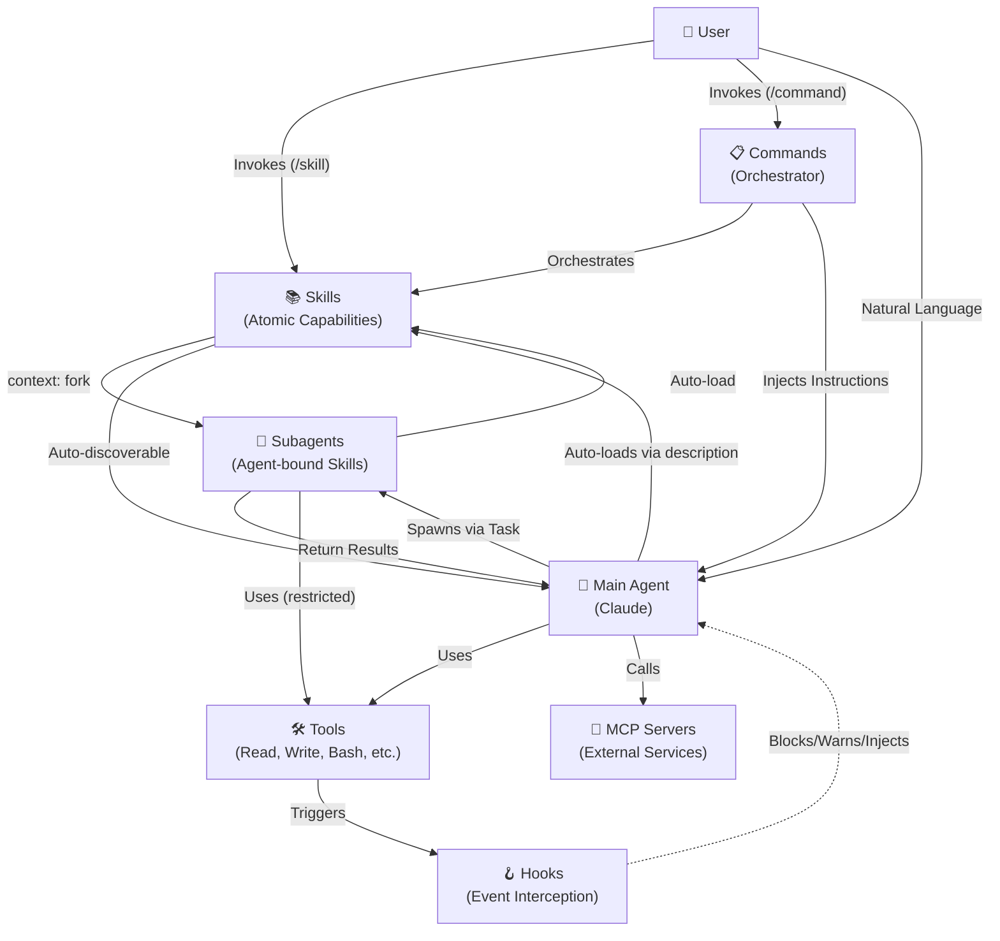

# Component Interaction Graph

This document maps the valid interactions between components in the Agentic Runtime.

---

## Visual Graph



---

## Interaction Matrix

| From | To | Mechanism | Notes |
|:-----|:---|:----------|:------|
| **User** | Skill | `/skill-name` invocation | Direct slash command (if `user-invocable: true`) |
| **User** | Command | `/command` invocation | Orchestration workflows |
| **User** | Main Agent | Natural language | Chat interaction |
| **Command** | Skill | Orchestration | Sequences multiple Skills |
| **Command** | Main Agent | Prompt injection | Command becomes system prompt |
| **Main Agent** | Subagent | `Task` tool | Spawns specialized persona |
| **Main Agent** | Skill | Description match | Auto-loads on semantic match |
| **Main Agent** | Tool | Direct invocation | Read, Write, Bash, etc. |
| **Skill** | Subagent | `context: fork` | Runs in isolated context |
| **Skill** | Agent | `agent: [name]` | Binds to reusable persona |
| **Subagent** | Main Agent | Result return | Returns findings/output |
| **Subagent** | Skill | Description match | Auto-loads on semantic match |
| **Subagent** | Command | `Skill` tool | Can invoke `/commit`, `/test`, etc. |
| **Subagent** | Tool | Direct invocation | Restricted by `tools` field |
| **Tool** | Hook | Event trigger | PreToolUse, PostToolUse, etc. |
| **Hook** | Main Agent | Inject/Block | System message or block action |

---

## Key Concepts

### Forked Skills (context: fork)
Skills with `context: fork` run in **isolated context**:
- No shared conversation history
- Self-contained execution environment
- Replaces Task tool delegation
- Faster execution (no delegation overhead)

### Agent-Bound Skills (agent: [name])
Skills can bind to reusable personas:
- Inherits system prompt from `agents/[name].md`
- Inherits tool restrictions
- Enables persona reuse across multiple Skills
- Maintains separation: Persona ≠ Task

### Command → Skill Flow
```
User invokes /command
    → Command markdown injected as instructions
    → Main Agent interprets instructions
    → Command orchestrates multiple Skills
    → Skills execute (with or without agent binding)
    → Main Agent synthesizes response
```

### Direct Skill Invocation
```
User invokes /skill-name
    → Skill runs with `context: fork`
    → If `agent: [name]` is set, binds to persona
    → Skill executes independently
    → Returns results directly
```

### Skill Loading
```
Agent encounters task
    → Runtime matches task against Skill descriptions
    → Matching Skills auto-load into context
    → Agent applies Skill knowledge to task
```

### Tool → Hook Flow
```
Agent invokes Tool (e.g., Write)
    → PreToolUse hooks fire
    → Hook may block or modify
    → Tool executes (if not blocked)
    → PostToolUse hooks fire
```

---

## Restrictions

| Component | Cannot Do |
|:----------|:----------|
| **Commands** | Spawn agents directly (must orchestrate Skills) |
| **Skills** | Execute actions without context or agent binding |
| **Empty Shell Agents** | Should be deleted (use `allowed-tools` in Skill) |
| **Built-in Subagents** | Use Skills (Explore, Plan, general-purpose) |
| **Hooks** | Trigger other hooks |

---

## MCP Integration

MCP (Model Context Protocol) servers provide external tool access:

```
Main Agent
    → Calls MCP tool (e.g., database query)
    → MCP Server executes externally
    → Returns result to Main Agent
```

MCP tools are subject to the same `tools` restrictions as native tools.
