# Component Interaction Graph

This document maps the valid interactions between components in the Agentic Runtime.

---

## Visual Graph

```mermaid
graph TB
    User["👤 User"]
    MainAgent["🤖 Main Agent<br/>(Claude)"]
    Commands["📋 Commands<br/>(Orchestrator)"]
    ForkedSkills["🔧 Forked Skills<br/>(context: fork)"]
    Skills["📚 Skills<br/>(Atomic Capabilities)"]
    Agents["👥 Agents<br/>(Personas)"]
    Tools["🛠️ Tools<br/>(Read, Write, Bash, etc.)"]
    Hooks["🪝 Hooks<br/>(Event Interception)"]
    MCP["🔌 MCP Servers<br/>(External Services)"]

    User -->|"Invokes (/skill)"| ForkedSkills
    User -->|"Invokes (/command)"| Commands
    User -->|"Natural Language"| MainAgent

    Commands -->|"Orchestrates"| Skills
    Commands -->|"Injects Instructions"| MainAgent

    MainAgent -->|"Auto-loads via description"| Skills
    MainAgent -->|"Uses"| Tools
    MainAgent -->|"Calls"| MCP

    Skills -->|"context: fork"| ForkedSkills
    ForkedSkills -.->|"Binds Persona"| Agents
    ForkedSkills -->|"Executes"| Tools
    Skills -->|"Auto-discoverable"| MainAgent

    Tools -->|"Triggers"| Hooks
    Hooks -.->|"Blocks/Warns/Injects"| MainAgent
```



---

## Interaction Matrix

| From | To | Mechanism | Notes |
|:-----|:---|:----------|:------|
| **User** | Forked Skill | `/skill-name` invocation | Direct invocation with `context: fork` |
| **User** | Command | `/command` invocation | Orchestration workflows |
| **User** | Main Agent | Natural language | Chat interaction |
| **Command** | Skill | Orchestration | Sequences multiple Skills |
| **Command** | Main Agent | Prompt injection | Command becomes system prompt |
| **Main Agent** | Skill | Description match | Auto-loads on semantic match |
| **Main Agent** | Tool | Direct invocation | Read, Write, Bash, etc. |
| **Skill** | Forked Skill | `context: fork` | Creates isolated execution context |
| **Forked Skill** | Agent | `agent: [name]` | Binds to reusable persona |
| **Forked Skill** | Tool | Direct execution | Uses inherited or allowed tools |
| **Agent** | Skill | Description match | Auto-loads on semantic match |
| **Agent** | Command | `Skill` tool | Can invoke `/commit`, `/test`, etc. |
| **Tool** | Hook | Event trigger | PreToolUse, PostToolUse, etc. |
| **Hook** | Main Agent | Inject/Block | System message or block action |

---

## Key Concepts

### Forked Skills (context: fork) - PRIMARY EXECUTION METHOD
Skills with `context: fork` run in **isolated execution context**:
- No shared conversation history
- Self-contained execution environment
- **Replaces Task tool delegation for atomic tasks**
- Direct invocation via `/skill-name`
- Optional agent persona binding

### Agent-Bound Skills (agent: [name])
Forked Skills can bind to reusable personas:
- Inherits system prompt from `agents/[name].md`
- Inherits tool restrictions
- Enables persona reuse across multiple Skills
- **Personas are reusable identities, not delegation mechanisms**

### Direct Skill Invocation (2026 Pattern)
```
User invokes /security-audit
    → Forked Skill runs with `context: fork`
    → If `agent: security-expert` is set, binds to persona
    → Skill executes independently in isolated context
    → Returns results directly
```

### Command Orchestration Pattern
```
User invokes /feature-dev
    → Command markdown injected as instructions
    → Main Agent interprets instructions
    → Command orchestrates multiple Skills:
      - Use skill: architecture-review (context: fork)
      - Use skill: code-generator (context: fork)
      - Use skill: test-validator (context: fork)
    → Main Agent synthesizes response
```

### Skill Loading
```
Main Agent encounters task
    → Runtime matches task against Skill descriptions
    → Matching Skills auto-load into context
    → If `context: fork` set, creates isolated execution
    → Agent applies Skill knowledge to task
```

### Legacy Pattern (Deprecated)
```
Main Agent uses Task tool
    → Spawns subagent in separate context
    → Subagent has separate conversation history
    → Returns results to Main Agent
```
**Note:** Use Forked Skills instead for atomic tasks.

---

## Restrictions

| Component | Cannot Do |
|:----------|:----------|
| **Commands** | Execute atomic tasks (must orchestrate Skills) |
| **Skills** | Run without `context: fork` for complex execution |
| **Wrapper Commands** | Wrap single Skills (use Forked Skill instead) |
| **Empty Shell Agents** | Should be deleted (use `allowed-tools` in Skill) |
| **Built-in Agents** | Use Forked Skills for atomic tasks |
| **Hooks** | Trigger other hooks |

## Decision Tree: What to Use When

1. **Atomic task** (security scan, code analysis)
   - ✅ Forked Skill with `context: fork`
   - ❌ Command wrapping a Skill

2. **Multi-phase workflow** (feature dev, project setup)
   - ✅ Command orchestrating multiple Skills
   - ❌ Single Skill with complex logic

3. **Reusable persona** (security expert, code reviewer)
   - ✅ Agent definition + Skill binding via `agent: [name]`
   - ❌ Hardcoded instructions in multiple Skills

4. **Simple tool restriction** (read-only analysis)
   - ✅ Skill with `allowed-tools: [Read, Grep]`
   - ❌ Separate Agent with same restrictions

---

## MCP Integration

MCP (Model Context Protocol) servers provide external tool access:

```
Main Agent
    → Calls MCP tool (e.g., database query)
    → MCP Server executes externally
    → Returns result to Main Agent
```

MCP tools are subject to the same `tools` restrictions as native tools.
