# Skills Overview

> Skills are markdown files that teach Claude how to do something specific. When you ask Claude something that matches a Skill's purpose, Claude automatically applies it.

## Philosophy: Skills are Knowledge, Not Agents

Skills are **Knowledge Bases**—passive procedural knowledge. They are standards, templates, and methodologies that an Agent "puts on" like a lens to view a task.

**Key Principle:** The `description` field is the **API Signature**. Claude uses it to decide when to apply the Skill.

---

## How Skills Work

Skills are **model-invoked**: Claude decides which Skills to use based on your request. You don't need to explicitly call a Skill.

### Discovery → Activation → Execution

```mermaid
flowchart LR
    A["🔍 Discovery<br/>name + description<br/>loaded at startup"] --> B["⚡ Activation<br/>Request matches description<br/>SKILL.md loaded"]
    B --> C["🚀 Execution<br/>Instructions followed<br/>Resources loaded on-demand"]
```



| Phase | What Happens | Token Cost |
|:------|:-------------|:-----------|
| **Discovery** | Only `name` + `description` loaded at startup | ~100 tokens |
| **Activation** | Full `SKILL.md` loaded when description matches | <5000 tokens |
| **Execution** | Referenced files/scripts loaded on-demand | Unlimited |

---

## Where Skills Live

| Location | Path | Applies To |
|:---------|:-----|:-----------|
| **Enterprise** | Managed settings | All users in organization |
| **Personal** | `~/.claude/skills/` | You, across all projects |
| **Project** | `.claude/skills/` | Anyone in this repository |
| **Plugin** | `skills/` in plugin | Anyone with plugin installed |

> [!NOTE]
> If two Skills have the same name, higher rows win: enterprise overrides personal, personal overrides project, project overrides plugin.

---

## SKILL.md Anatomy

Every Skill needs a `SKILL.md` file with YAML frontmatter and Markdown instructions:

```yaml
---
name: your-skill-name
description: Brief description of what this Skill does and when to use it
---

## Instructions
Provide clear, step-by-step guidance for Claude.

## Examples
Show concrete examples of using this Skill.
```

### Directory Structure

```
skill-name/
├── SKILL.md          # Required: Instructions + Metadata
├── references/       # On-demand docs (loaded into context)
├── assets/           # Templates (used in output)
└── scripts/          # Executables (run without loading into context)
```

**Auto-discovery:** All `SKILL.md` files in subdirectories are automatically indexed.

---

## Frontmatter Reference

| Field | Required | Description |
|:------|:---------|:------------|
| `name` | **Yes** | Skill name. Lowercase letters, numbers, hyphens only (max 64 chars). Must match directory name. |
| `description` | **Yes** | What the Skill does and when to use it (max 1024 chars). Claude uses this for semantic matching. |
| `allowed-tools` | No | Tools Claude can use without asking permission. Comma-separated or YAML list. |
| `model` | No | Model to use (`claude-sonnet-4-20250514`, etc.). Defaults to conversation's model. |
| `context` | No | Set to `fork` to run in isolated sub-agent context. |
| `agent` | No | Agent type for forked context (`Explore`, `Plan`, `general-purpose`, or custom agent name). |
| `hooks` | No | Hooks scoped to Skill lifecycle (`PreToolUse`, `PostToolUse`, `Stop`). |
| `user-invocable` | No | Controls slash command menu visibility. Default: `true`. |
| `disable-model-invocation` | No | Blocks programmatic invocation via `Skill` tool. Default: `false`. |

### Complete Example

```yaml
---
name: security-audit
description: |
  Analyze codebases for security vulnerabilities.
  USE when auditing code security, scanning for injection flaws, or reviewing authentication.
  Keywords: security audit, vulnerability scan, penetration test, XSS, SQL injection
context: fork
agent: security-expert
user-invocable: true
allowed-tools:
  - Read
  - Grep
  - Bash
hooks:
  PreToolUse:
    - matcher: "Bash"
      hooks:
        - type: command
          command: "./scripts/security-check.sh $TOOL_INPUT"
          once: true
---

# Security Audit Skill

## Analysis Steps
1. Scan for common vulnerability patterns (injection, XSS, CSRF)
2. Review authentication and authorization flows
3. Check for secrets in code
4. Validate input sanitization

## Reporting Format
Generate findings with severity, location, and remediation steps.
```

---

## Skill Permissions

### allowed-tools: Restrict Tool Access

Use `allowed-tools` to limit which tools Claude can use during Skill execution:

```yaml
---
name: safe-reader
description: Read files safely without modifications
allowed-tools: Read, Grep, Glob
---
```

**Effect:** Claude can only use specified tools without needing permission. Useful for:
- Read-only Skills that shouldn't modify files
- Security-sensitive workflows with limited scope
- Data analysis without write access

**Comma-separated or YAML list:**
```yaml
# Inline format
allowed-tools: Read, Grep, Glob

# YAML list format
allowed-tools:
  - Read
  - Grep
  - Glob
```

> [!IMPORTANT]
> If `allowed-tools` is omitted, the Skill doesn't restrict tools. Claude uses its standard permission model.

---

## Visibility Controls

Skills can be invoked three ways:
1. **Manual:** User types `/skill-name`
2. **Programmatic:** Claude calls via `Skill` tool
3. **Automatic:** Claude discovers based on description

### Visibility Matrix

| Setting | Slash Menu | `Skill` Tool | Auto-Discovery | Use Case |
|:--------|:-----------|:-------------|:---------------|:---------|
| `user-invocable: true` (default) | ✅ Visible | ✅ Allowed | ✅ Yes | User-facing Skills |
| `user-invocable: false` | ❌ Hidden | ✅ Allowed | ✅ Yes | Internal Skills Claude uses |
| `disable-model-invocation: true` | ✅ Visible | ❌ Blocked | ✅ Yes | User-only Skills |

**Example: Model-Only Skill**
```yaml
---
name: internal-standards
description: Apply internal code standards during review
user-invocable: false
---
```
Hidden from `/` menu, but Claude can invoke programmatically or discover automatically.

---

## Forked Context Pattern

Use `context: fork` to run Skills in isolated sub-agent contexts:

```yaml
---
name: code-analysis
description: Analyze code quality and generate detailed reports
context: fork
agent: code-reviewer
---
```

### Benefits
- **Isolated history:** No cluttering of main conversation
- **Specialized persona:** Uses bound agent's system prompt
- **Self-contained execution:** No Task tool needed

### Agent Binding

When combined with `context: fork`, the `agent` field specifies which agent runs the Skill:

| `agent` Value | Behavior |
|:--------------|:---------|
| `Explore` | Built-in exploration agent |
| `Plan` | Built-in planning agent |
| `general-purpose` | Default agent (if omitted) |
| `my-agent` | Custom agent from `.claude/agents/my-agent.md` |

---

## Skill-Defined Hooks

Skills can define lifecycle hooks in frontmatter:

```yaml
---
name: secure-operations
description: Perform operations with security checks
hooks:
  PreToolUse:
    - matcher: "Bash"
      hooks:
        - type: command
          command: "./scripts/validate-command.sh $TOOL_INPUT"
          once: true
  PostToolUse:
    - matcher: "Write"
      hooks:
        - type: command
          command: "./scripts/scan-output.sh $FILE_PATH"
---
```

| Hook | Trigger | Use Case |
|:-----|:--------|:---------|
| `PreToolUse` | Before tool execution | Validate inputs, block risky operations |
| `PostToolUse` | After tool success | Run linters, security scans |
| `Stop` | Skill finishes | Cleanup, final validation |

The `once: true` option runs the hook only once per session.

---

## Progressive Disclosure

Keep `SKILL.md` under 500 lines. Use separate files for detailed content:

### Resource Types

| Directory | Purpose | Loading | Token Budget |
|:----------|:--------|:--------|:-------------|
| `references/` | Documentation, API specs | Loaded into context when read | Counted |
| `assets/` | Templates, data files | Used in output | Counted |
| `scripts/` | Executable utilities | **Run without loading** | **Unlimited** |

### Zero-Context Script Pattern

Move complex logic to `scripts/` to avoid consuming context tokens:

```yaml
---
name: complex-validator
description: Validate complex business rules
---

# Run validation without loading script into context
python scripts/validate.py $INPUT_FILE
```

**Benefits:**
- SKILL.md stays lightweight (<100 tokens)
- Complex logic in scripts (no token limit)
- Easier to test independently

### Linking Reference Files

Tell Claude about supporting files:

```markdown
## Additional Resources

- For complete API details, see [reference.md](reference.md)
- For usage examples, see [examples.md](examples.md)
```

> [!TIP]
> Keep references one level deep. Link directly from SKILL.md to reference files. Deeply nested references may result in Claude partially reading files.

---

## Skills and Subagents

### Give Subagents Access to Skills

Subagents do NOT automatically inherit Skills. Specify them explicitly in custom agent definitions:

```yaml
# .claude/agents/code-reviewer.md
---
name: code-reviewer
description: Review code for quality and best practices
skills: pr-review, security-check
---
```

> [!WARNING]
> Built-in agents (`Explore`, `Plan`, `general-purpose`) do not have access to your Skills. Only custom subagents with explicit `skills` field can use Skills.

### Run Skill AS Subagent

Use `context: fork` + `agent` to run a Skill in a forked subagent context (see [Forked Context Pattern](#forked-context-pattern)).

---

## Writing Effective Descriptions

The `description` field determines when Claude uses your Skill.

### Good Description Anatomy

```yaml
description: |
  Extract text and tables from PDF files, fill forms, merge documents.
  USE when working with PDF files or when user mentions PDFs, forms, or document extraction.
  Keywords: PDF, forms, document extraction, merge, fill
```

**Answer two questions:**
1. **What does this Skill do?** List specific capabilities.
2. **When should Claude use it?** Include trigger terms users would say.

### Discovery Tiering Matrix

| Tier | Use Case | Pattern |
|:-----|:---------|:--------|
| **1: High Fidelity** | Complex tasks, override default behavior | `[MODAL] when [CONDITION].` |
| **2: High Gravity** | Safety, Security, Governance | `[MODAL] USE when [CONDITION].` |
| **3: Utility** | Simple helper tools | `{Action} {Object}` |

**Examples:**
```yaml
# Tier 1: High Fidelity
description: "MUST use when reviewing TypeScript code. Enforces strictNullChecks and no-any policy."

# Tier 2: High Gravity  
description: "USE when deploying to production. Validates security requirements."

# Tier 3: Utility
description: "Format JSON files with consistent indentation."
```

---

## Writing Style

Write for the **Agent**, not the User. Use imperative form:

```markdown
# ✅ Correct (Imperative)
Verify all inputs using the Zod schema before processing.
Use the repository standard formatting.

# ❌ Incorrect (Conversational)
You should make sure to check the inputs.
I think it's robust to use Zod.
```

---

## Complete Examples

### Simple Skill (Single File)

```
commit-helper/
└── SKILL.md
```

```yaml
---
name: commit-helper
description: |
  Generate clear commit messages from git diffs.
  USE when writing commit messages or reviewing staged changes.
---

## Instructions

1. Run `git diff --staged` to see changes
2. Generate commit message with:
   - Summary under 50 characters
   - Detailed description
   - Affected components

## Best Practices

- Use present tense
- Explain what and why, not how
```

### Multi-File Skill with Scripts

```
pdf-processing/
├── SKILL.md
├── FORMS.md
├── REFERENCE.md
└── scripts/
    ├── fill_form.py
    └── validate.py
```

**SKILL.md:**
```yaml
---
name: pdf-processing
description: |
  Extract text, fill forms, merge PDFs.
  USE when working with PDF files, forms, or document extraction.
  Requires pypdf and pdfplumber packages.
allowed-tools: Read, Bash(python:*)
---

# PDF Processing

## Quick Start

Extract text:
```python
import pdfplumber
with pdfplumber.open("doc.pdf") as pdf:
    text = pdf.pages[0].extract_text()
```

For form filling, see [FORMS.md](FORMS.md).
For detailed API reference, see [REFERENCE.md](REFERENCE.md).

## Requirements

```bash
pip install pypdf pdfplumber
```
```

### Forked Skill with Agent Binding

```yaml
---
name: security-scanner
description: |
  Scan codebases for security vulnerabilities.
  USE for security audits, vulnerability scans, or penetration testing.
context: fork
agent: security-expert
user-invocable: true
allowed-tools:
  - Read
  - Grep
  - Bash
---

# Security Scanner

Operates in isolated context with security-expert persona.
Direct slash command: /security-scanner [target]
```

---

## Troubleshooting

### Skill Not Triggering

**Cause:** Description too vague or missing keywords.

**Fix:** Include specific capabilities and trigger terms:
```yaml
# ❌ Vague
description: "Helps with documents"

# ✅ Specific
description: "Extract text and tables from PDF files. USE when working with PDFs or document extraction."
```

### Skill Doesn't Load

**Check file path:**
| Type | Required Path |
|:-----|:--------------|
| Personal | `~/.claude/skills/my-skill/SKILL.md` |
| Project | `.claude/skills/my-skill/SKILL.md` |
| Plugin | `skills/my-skill/SKILL.md` |

**Check YAML syntax:**
- Frontmatter must start with `---` on line 1 (no blank lines before)
- Use spaces for indentation (not tabs)
- End with `---` before Markdown content

**Run debug mode:**
```bash
claude --debug
```

### Multiple Skills Conflict

**Cause:** Descriptions too similar.

**Fix:** Make each description distinct with specific trigger terms:
```yaml
# ❌ Similar
description: "Data analysis"

# ✅ Distinct
description: "Analyze sales data in Excel files and CRM exports"
description: "Analyze log files and system metrics"
```

### Plugin Skills Not Appearing

**Solution:** Clear cache and reinstall:
```bash
rm -rf ~/.claude/plugins/cache
# Restart Claude Code, then:
/plugin install plugin-name@marketplace-name
```

---

## Skills vs Other Options

| Use This | When You Want To... | When It Runs |
|:---------|:--------------------|:-------------|
| **Skills** | Give Claude specialized knowledge | Claude chooses when relevant |
| **Slash Commands** | Create reusable prompts | You type `/command` |
| **CLAUDE.md** | Set project-wide instructions | Loaded into every conversation |
| **Subagents** | Delegate to separate context | Claude delegates, or you invoke |
| **Hooks** | Run scripts on events | Fires on specific tool events |
| **MCP Servers** | Connect to external tools/data | Claude calls MCP tools as needed |

**Skills vs Subagents:** Skills add knowledge to current conversation. Subagents run in separate context. Use Skills for guidance; use subagents for isolation.

**Skills vs MCP:** Skills tell Claude *how* to use tools; MCP *provides* the tools.
