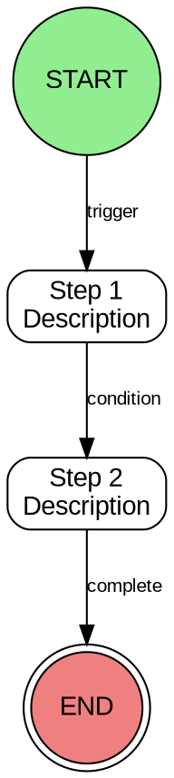
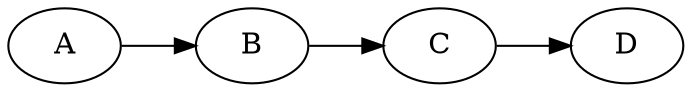
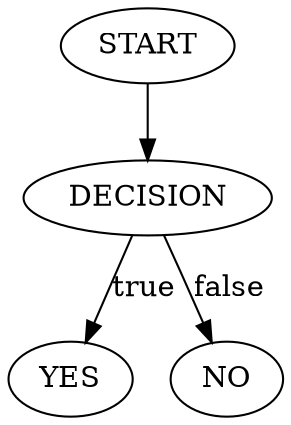
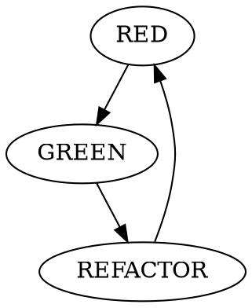

# Visual Documentation Standards

This directory contains Graphviz DOT diagrams for visualizing Cat Toolkit workflows, processes, and architectures.

## Why Graphviz DOT?

- **Text-based**: Version control friendly (diffs work perfectly)
- **Tool-agnostic**: Works everywhere Graphviz is installed
- **Scalable**: Renders to PNG, SVG, PDF at any resolution
- **Native rendering**: GitHub renders .dot files automatically

## When to Use Diagrams

### USE Diagrams For:
- Complex workflows (>5 steps)
- Multi-system interactions
- State machines with branching logic
- Decision trees with multiple paths
- Architecture overviews

### AVOID Diagrams For:
- Simple linear processes (3-4 steps)
- Single-file structures
- Lists or tables
- Obvious sequences

## Template Structure



## Rendering Diagrams

### Generate PNG (Raster)
```bash
dot -Tpng docs/diagrams/skill-lifecycle.dot -o docs/diagrams/skill-lifecycle.png
```

### Generate SVG (Vector, Recommended)
```bash
dot -Tsvg docs/diagrams/skill-lifecycle.dot -o docs/diagrams/skill-lifecycle.svg
```

### Generate PDF
```bash
dot -Tpdf docs/diagrams/skill-lifecycle.dot -o docs/diagrams/skill-lifecycle.pdf
```

### View in Terminal (macOS)
```bash
dot -Tpng docs/diagrams/skill-lifecycle.dot | open -f -
```

## Available Templates

### skill-lifecycle.dot
6-step workflow for creating skills:
1. Identify Need → Write Scenario → Frontmatter → Protocol → Validate → Deploy

### tdd-skills-cycle.dot
TDD for Skills cycle: RED (Scenario) → GREEN (Implement) → REFACTOR (Optimize)

### trigger-optimization.dot
SEO optimization flow: Start → Identify Capability → Triggers → Negative → Test → Optimize

## Linking Diagrams in Documentation

```markdown
## Skill Creation Process

See [visual workflow](skill-lifecycle.dot) for detailed process diagram.

Key steps:
1. Identify need
2. Write scenario
...
```

## Accessibility

**Always provide text alternative** for accessibility and quick reference:

```markdown
## Skill Creation Process

[Diagram: 6-step workflow showing scenario→frontmatter→protocol→validate→optimize→deploy]

**Text-based alternative**:
1. Identify need from user requirements
2. Write usage scenario (TDD-Skills RED phase)
3. Create frontmatter with optimized description
4. Write protocol-based instructions
5. Test activation across models
6. Optimize description if activation fails
7. Deploy when activation passes
```

## Common Diagram Patterns

### Sequence Flow (Linear)


### Decision Tree (Branching)


### State Machine (Cyclical)


## Best Practices

1. **Keep it simple**: Maximum 10-15 nodes per diagram
2. **Use consistent styling**: Same colors, shapes across diagrams
3. **Label edges clearly**: Every edge should explain the transition
4. **Provide text alternatives**: Accessibility and quick reference
5. **Version control**: .dot files are text, use git effectively

## Naming Convention

- Use `kebab-case.dot` format
- Be descriptive: `skill-lifecycle.dot` not `diagram1.dot`
- Keep names under 30 characters

## Installation

### macOS
```bash
brew install graphviz
```

### Ubuntu/Debian
```bash
sudo apt-get install graphviz
```

### Verify Installation
```bash
dot -V
# Should output: dot - graphviz version X.X.X
```
