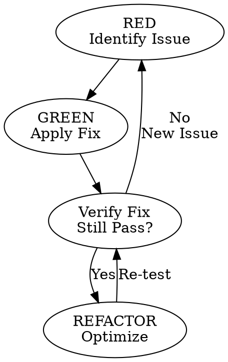

# Skill Archetypes: A Catalog of Patterns

**Purpose:** This document catalogs skill archetypes and real-world patterns as a **source of inspiration** for skill authors.

**⚠️ Important:** These are **patterns for inspiration**, not prescriptive rules. Adapt them to your specific context, requirements, and use cases.

---

## Part 1: Extended Archetypes Catalog

The existing skills guide defines 4 core archetypes. This section extends that catalog with additional patterns observed in successful codebases.

### Core Archetypes (from skills.md)

| # | Archetype | Purpose | Pattern |
|:-|:----------|:-------|:--------|
| 1 | **Procedural** | Deterministic, repeatable processes | Exact steps, validation gates |
| 2 | **Advisory** | Expertise and recommendations | Heuristic principles, contextual adaptation |
| 3 | **Generator** | Input→Output transformation | Template-driven, validation-enhanced |
| 4 | **Orchestrator** | Coordinate multiple capabilities | Explicit dependencies, pipeline sequencing |

### Extended Archetypes (inspirational patterns)

#### 5. Scenario-Driven Pattern

**Inspired by:** obra/superpowers (`test-driven-development`, `writing-plans`)

**Purpose:** Skills designed using TDD methodology, starting with usage scenarios before implementation.

**Pattern:** RED (Scenario) → GREEN (Implementation) → REFACTOR (Optimization)

**When this pattern shines:**
- Complex multi-step operations where you need to validate the approach first
- Skills that interact with other skills or systems
- User-facing workflows with multiple decision paths
- Situations where the exact implementation isn't known upfront

**Key characteristics to consider:**
- Usage scenario written first (before implementation)
- Expected behavior documented upfront
- Edge cases and constraints identified early
- Activation tested across models
- Description optimized for discoverability

**Not this pattern if:**
- The process is well-understood and deterministic
- You're implementing a known protocol or algorithm
- The skill is a simple wrapper around existing tools

---

#### 6. Evidence-Driven Pattern

**Inspired by:** obra/superpowers (`requesting-code-review`), security audit skills

**Purpose:** Skills that require file references, shell output, and reproducible evidence for claims.

**Pattern:** Claim + Evidence (file:line or shell output)

**When this pattern shines:**
- Security audits and vulnerability assessments
- Code analysis and architectural reviews
- Performance investigations
- Compliance verification

**Key characteristics to consider:**
- Every claim includes file reference with line number
- Shell output included for validation evidence
- Grep results for search-based findings
- Qualifying language used only when evidence unavailable
- Claims are verifiable and reproducible

**Not this pattern if:**
- Providing general guidance or best practices
- Documenting well-known patterns or algorithms
- Creating forward-looking recommendations

---

#### 7. State-Machine Pattern

**Inspired by:** obra/superpowers (`test-driven-development`, `systematic-debugging`, `verification-before-completion`)

**Purpose:** Skills with clear state transitions and cyclical or iterative workflows.

**Pattern:** RED → GREEN → REFACTOR → (repeat) or other state cycles

**When this pattern shines:**
- Iterative refinement processes
- Multi-stage workflows with feedback loops
- Quality gates with verification steps
- Optimization cycles with convergence criteria

**Key characteristics to consider:**
- Explicit state transitions with entry/exit conditions
- Cyclical or iterative process flow
- State persistence between cycles
- Clear decision criteria for state transitions
- Visual diagram documentation (DOT) recommended

**Not this pattern if:**
- Linear one-shot processes
- Simple sequential workflows
- Single-pass operations

---

#### 8. Subtask-Dispatching Pattern

**Inspired by:** obra/superpowers (`dispatching-parallel-agents`), Cat Toolkit isolation strategies

**Purpose:** Skills that coordinate parallel subtasks or independent operations.

**Pattern:** Identify → Dispatch (parallel) → Aggregate → Return

**When this pattern shines:**
- Large-scale codebase analysis across multiple dimensions
- Multi-repository operations
- Parallel testing across environments
- Cross-domain validation where independence exists

**Key characteristics to consider:**
- Identifies independent subtasks upfront
- Uses `context: fork` for isolation (avoid subagent token cost)
- Aggregates results from multiple sources
- Handles failures gracefully with fallbacks
- Clear cost-benefit analysis of parallelization

**Critical distinction:**
- **Use `context: fork`** (~3× token cost) for isolation
- **Avoid spawning subagents** (~20k+ tokens + 1 quota each)

**Not this pattern if:**
- Tasks are inherently sequential/dependent
- Single-file or single-operation scope
- Overhead of coordination exceeds benefits

---

#### 9. Diagram-First Pattern

**Inspired by:** obra/superpowers visual documentation, TDD cycle diagrams

**Purpose:** Skills where visual diagrams are the primary documentation, not supplementary.

**Pattern:** DOT diagram + Text alternative + Implementation

**When this pattern shines:**
- Complex workflows (>5 steps) with branching logic
- Multi-system interactions or integrations
- State machines with multiple decision points
- Skills where the visual model aids understanding

**Key characteristics to consider:**
- Graphviz DOT diagram in `references/diagrams/`
- Diagram serves as primary documentation
- Text alternative provided for accessibility
- Diagram files are version-controlled (.dot)
- Can render to PNG/SVG for viewing

**Not this pattern if:**
- Simple linear processes (3-4 steps)
- Single-file structures
- Lists or tables suffice
- Process is obvious without visualization

---

## Part 2: Description Pattern Inspirations

### Two Valid Approaches

Based on research across multiple repositories, two primary description patterns have emerged. **Both are valid** - choose based on your use case.

#### Pattern A: Cat Toolkit Standard (with modality markers)

**Inspired by:** Cat Toolkit internal infrastructure

**Format:**
```yaml
description: "{CAPABILITY}. {MODAL} Use when {TRIGGERS}. Modes: {MODES}."
```

**Example:**
```yaml
description: "Provides Universal Standard for Test-Driven Development. PROACTIVELY Use when writing code, debugging, or implementing features. Modes: debug, review, refactor. Enforces RED-GREEN-REFACTOR cycle."
```

**Consider this pattern when:**
- Skill requires explicit invocation guidance
- Multiple operational modes exist
- Critical/compliance scope (MUST use cases)
- Internal toolkit infrastructure
- User needs clear usage direction

**Modality markers reference:**

| Marker | Meaning | When to Use | % of Skills |
|:-------|:--------|:-----------|:-----------|
| **MUST** | Critical requirement | Security, compliance, safety | 5-10% |
| **PROACTIVELY** | Primary orchestration | Core workflow skills | 10-15% |
| **SHOULD** | Recommended practice | Quality assurance | 15-20% |
| *(none)* | Standard discovery | General tools | 60-70% |

---

#### Pattern B: Simple Discovery (obra/superpowers standard)

**Inspired by:** obra/superpowers, anthropics/claude-plugins-official

**Format:**
```yaml
description: "{CAPABILITY}. Use when {TRIGGERS}. Do not use for {EXCLUSIONS}."
```

**Example:**
```yaml
description: "Extracts structured invoice data from PDF files. Use when user mentions invoices, PDF parsing, or extracting financial data. Handles multi-page invoices, varied layouts, and common edge cases. Do not use for PDF generation, editing, or image-only PDFs."
```

**Consider this pattern when:**
- Skill is user-facing/portable
- Single-mode operation
- Marketplace-distributed skills
- General-purpose tools
- Simpler discovery is sufficient

---

### Pattern Decision Flowchart

```
Is this skill CRITICAL for security/safety?
├─ YES → Consider Pattern A with MUST marker
│         Example: "MUST Use when verifying security"
└─ NO → Is this a CORE orchestration skill?
        ├─ YES → Consider Pattern A with PROACTIVELY marker
        │         Example: "PROACTIVELY Use when handling queries"
        └─ NO → Is this RECOMMENDED but not required?
                ├─ YES → Consider Pattern A with SHOULD marker
                │         Example: "SHOULD Use when reviewing PRs"
                └─ NO → Pattern B (simple discovery) is likely sufficient
                          Example: "Extracts data from PDF files"
```

### Hybrid Pattern (for complex skills)

For skills with multiple operational modes AND marketplace intent:

```yaml
description: "Orchestrates comprehensive codebase analysis across security, performance, and architecture. PROACTIVELY Use when conducting full audits or multi-dimensional reviews. Do not use for single-file analysis or quick checks. Supports modes: security-only, performance-only, full-audit."
```

**Structure:**
1. **Capability**: "Orchestrates comprehensive codebase analysis..."
2. **Modality**: "PROACTIVELY Use when..." (internal guidance)
3. **Trigger**: "...conducting full audits..." (SEO discovery)
4. **Negative**: "Do not use for single-file..." (exclusion)
5. **Modes**: "Supports modes: ..." (operational flexibility)

---

## Part 3: Real-World Pattern Inspirations

### Pattern 1: TDD-Based Skill Creation

**Inspired by:** obra/superpowers `writing-skills`, `test-driven-development`

**The pattern:** Write usage scenario → Implement skill → Test activation → Optimize

**Scenario:** Creating a PDF invoice parser skill

**RED Phase (Usage Scenario):**
```
User: "Can you extract data from these PDF invoices?"
Expected: Extract text + tables, return JSON with invoice_number, date, total, vendor_id
Constraints: Text-based PDFs only, handle multi-page
Edge cases: Missing fields, image-only PDFs
```

**GREEN Phase (Implementation):**
- Frontmatter with optimized description
- Protocol-based instructions
- Validation checkpoints

**REFACTOR Phase (Optimization):**
- Test activation: "extract data from these PDF invoices" ✅
- Test activation: "parse these invoices" ✅
- Test activation: "create PDF invoice" ❌
- Optimize: Added "Do not use for PDF generation"
- Move details to `references/`

**Key insight:** The scenario is written BEFORE any code, not AFTER.

---

### Pattern 2: Evidence-Based Security Audit

**Inspired by:** obra/superpowers `requesting-code-review`, security audit practices

**The pattern:** Every claim includes file:line evidence + bash output

**Example structure:**

```markdown
## Security Audit Findings

### SQL Injection (3 files)

**File:** `src/auth/login.py:45`
```python
def authenticate(username, password):
    query = f"SELECT * FROM users WHERE username='{username}'"
    #                                           ^^^^^^^^ VULNERABLE
    cursor.execute(query)
```
**Fix:** Use parameterized queries with `?` placeholders

### Validation Evidence

**Static Analysis:**
```bash
$ bandit -r src/
Results found 9 issues, 2 HIGH severity, 4 MEDIUM severity
```

**Test Results:**
```bash
$ python -m pytest tests/test_security.py
==================== 2 failed, 8 passed in 3.42s ====================
```
```

**Key insight:** No claim is made without supporting evidence.

---

### Pattern 3: State-Machine Refinement Cycle

**Inspired by:** obra/superpowers `test-driven-development`, TDD RED-GREEN-REFACTOR

**The pattern:** RED (identify issue) → GREEN (apply fix) → REFACTOR (optimize) → repeat

**Visual diagram:**


**State tracking in `_state.md`:**
```markdown
# Refinement State

**Current State:** REFACTOR
**Last Issue:** Duplicate session creation logic
**Last Action:** Extracted `create_session()` helper
**Tests Status:** PASS (156/156)
```

**Key insight:** State transitions are explicit and tracked.

---

### Pattern 4: Parallel Analysis with Fork

**Inspired by:** obra/superpowers `dispatching-parallel-agents`, Cat Toolkit isolation strategies

**The pattern:** Discover independent tasks → Dispatch with `context: fork` → Aggregate results

**Cost comparison:**

| Approach | Token Cost | Quota Cost |
|:---------|:-----------|:-----------|
| **Subagents** (WRONG) | 5 × 20k = 100k tokens | 5 quotas |
| **Fork** (CORRECT) | ~3× inline = ~15k tokens | 0 quotas |

**Example dispatch:**
```bash
# Fork 1: Security Analysis
cat > /tmp/fork-1-input.json << EOF
{
  "analysis_type": "security",
  "targets": "@targets.txt",
  "output": "findings/security.md"
}
EOF

# Fork 2: Performance Analysis
cat > /tmp/fork-2-input.json << EOF
{
  "analysis_type": "performance",
  "targets": "@targets.txt",
  "output": "findings/performance.md"
}
EOF

# Launch all forks in parallel
for i in {1..5}; do
  claude --context fork --input /tmp/fork-${i}-input.json &
done
wait  # Wait for all forks
```

**Aggregation:**
```markdown
## Comprehensive Analysis Results

### Security Analysis
[Content from findings/security.md]

### Performance Analysis
[Content from findings/performance.md]

### Cross-Cutting Findings
- `src/auth.py:45` - SQL injection (Security) + N+1 query (Performance)
```

**Key insight:** Fork for isolation when tasks are independent.

---

## Part 4: Using This Catalog

### How to Use These Patterns

1. **As inspiration, not prescription** - Adapt patterns to your specific context
2. **Mix and match** - Combine elements from multiple patterns as needed
3. **Validate with your use case** - Not every pattern fits every situation
4. **Test and iterate** - Use TDD approach: try pattern, validate, refine

### Decision Framework

When creating a skill, ask:

1. **What's the primary purpose?** → Points to an archetype
2. **What's the criticality level?** → Determines autonomy level (Protocol/Guided/Heuristic)
3. **What evidence do I need?** → Evidence-driven or general guidance?
4. **Is visual documentation helpful?** → Consider diagram-first
5. **Can tasks run in parallel?** → Consider subtask-dispatching
6. **What description pattern fits?** → Cat Toolkit vs. simple discovery

### Examples of Pattern Combination

**Example 1:** Procedural + Evidence-Driven
- Database migration with file references for each step
- Protocol-level autonomy with shell output verification

**Example 2:** Orchestrator + Subtask-Dispatching
- Multi-dimensional codebase analysis
- Parallel fork-based execution with result aggregation

**Example 3:** Advisory + Diagram-First
- Architectural review with DOT diagram showing decision tree
- Guided autonomy with visual decision framework

---

## Part 5: Anti-Patterns to Avoid

### Anti-Pattern 1: Workflow Summarization in Description

**Inspired by:** obra/superpowers research discovery

**The problem:** When descriptions summarize workflow, agents skip reading the skill body.

**Example of trap:**
```yaml
# BAD - Summarizes workflow
description: "Analyzes codebase by first scanning files, then checking dependencies, then reviewing quality, and finally generating reports."
```

**Correct approach:**
```yaml
# GOOD - Capability only
description: "Orchestrates comprehensive codebase analysis across multiple dimensions. Use when user mentions full code review or comprehensive analysis. Do not use for single-file analysis."
```

**Rule:** Description = When to Use (triggers), NEVER What the Process Is

---

### Anti-Pattern 2: Persona-Based Skills

**Inspired by:** Cat Toolkit "Protocol over Persona" principle

**The problem:** Persona-based skills waste tokens on role-playing.

**Example of trap:**
```yaml
# BAD - Persona-based
# You are a senior code reviewer with 15 years of experience...
# Your expertise includes...
```

**Correct approach:**
```yaml
# GOOD - Protocol-based
## Code Review Protocol

1. Scan for SQL injection, XSS, command injection
2. Verify input sanitization and output encoding
3. Check authentication/authorization patterns
4. Report findings by severity (Critical/Warning/Info)
```

**Rule:** Skills define protocols (procedures), not personas (identities)

---

### Anti-Pattern 3: Mega-Skills

**Inspired by:** Cat Toolkit "Atomic Boundaries" principle

**The problem:** Multiple unrelated domains in one skill.

**Example of trap:**
```yaml
# BAD - Multiple domains
description: "PDF processing, report generation, and data visualization"
```

**Correct approach:**
```yaml
# GOOD - Atomic boundaries
description: "Parse PDF invoices" (Skill 1) → "Generate financial reports" (Skill 2)
```

**Rule:** One domain per Skill, users think of it as single operation

---

## Part 6: Quick Reference

### Archetype Decision Matrix

| Need | Consider Archetype | Keywords |
|:-----|:-------------------|:---------|
| Write test first, watch it fail | Scenario-Driven | TDD, RED→GREEN→REFACTOR |
| Every claim needs evidence | Evidence-Driven | File references, shell output |
| Iterative improvement cycles | State-Machine | Cyclical, state transitions |
| Independent parallel tasks | Subtask-Dispatching | Fork-based, aggregation |
| Complex workflow visualization | Diagram-First | DOT diagrams, visual docs |
| Simple repeatable process | Procedural | Steps, validation gates |
| Expert guidance needed | Advisory | Heuristics, judgment |
| Transform input to output | Generator | Template-driven |
| Coordinate multiple skills | Orchestrator | Pipeline, dependencies |

### Description Pattern Decision Matrix

| Situation | Consider Pattern | Example |
|:----------|:--------------|:--------|
| Critical infrastructure | Pattern A (MUST) | "MUST Use when verifying security" |
| Core orchestration | Pattern A (PROACTIVELY) | "PROACTIVELY Use when handling queries" |
| Recommended practice | Pattern A (SHOULD) | "SHOULD Use when reviewing PRs" |
| General utility | Pattern B (simple) | "Extracts data from PDF files" |
| Multi-mode + marketplace | Hybrid | Both patterns combined |

---

## Part 7: Implementation Inspiration

### TDD-Based Skill Creation Checklist

**Phase 1: RED (Scenario)**
- [ ] Write example user request
- [ ] Document expected behavior
- [ ] Identify edge cases
- [ ] Define constraints

**Phase 2: GREEN (Implementation)**
- [ ] Create frontmatter with optimized description
- [ ] Write protocol-based instructions
- [ ] Add validation checkpoints
- [ ] Test activation

**Phase 3: REFACTOR (Optimization)**
- [ ] Test across models
- [ ] Optimize description
- [ ] Move details to `references/`
- [ ] Verify activation

### Evidence-Driven Checklist

**For each claim:**
- [ ] Can I point to a specific file? → Provide `path:line`
- [ ] Can I show command output? → Paste shell results
- [ ] Can I grep for it? → Show search results
- [ ] None of above? → Use qualifying language

### State-Machine Checklist

**Define states:**
- [ ] Entry condition for each state
- [ ] Exit condition for each state
- [ ] Transition triggers
- [ ] State persistence mechanism
- [ ] Visual diagram (DOT)

### Subtask-Dispatching Checklist

**Before dispatching:**
- [ ] Verify tasks are independent
- [ ] Calculate cost: fork vs. subagent
- [ ] Define aggregation strategy
- [ ] Plan fallback handling

**During execution:**
- [ ] Use `context: fork` for isolation
- [ ] Launch in parallel
- [ ] Wait for completion
- [ ] Aggregate results

---

## Part 8: Sources of Inspiration

### Research Repositories

- **obra/superpowers** (23k stars) - TDD for Skills, protocol-based approach, visual diagrams
- **anthropics/claude-plugins-official** (3.8k stars) - Official examples, simple descriptions
- **alirezarezvani/claude-skills** (631 stars) - Multi-domain expertise bundles
- **jeremylongshore/claude-code-plugins-plus-skills** (979 stars) - DevOps, security, ML categories

### Key Papers and Documentation

- **Cat Toolkit Skills Guide** - 3-tier loading, Delta Standard, autonomy levels
- **Anthropic Best Practices** - Protocol over persona, concise is key
- **TDD Literature** - RED-GREEN-REFACTOR cycle applied to documentation

### Community Patterns

- **Gerund naming convention** (`analyzing-data` not `data-analyst`)
- **Evidence-first validation** - Claims without evidence waste tokens
- **Visual workflow documentation** - DOT diagrams for complex processes
- **Modality markers** - MUST, PROACTIVELY, SHOULD for criticality levels

---

## Part 9: Contributing Patterns

Have you used a successful skill pattern that's not represented here? Consider documenting it for the community.

**Pattern documentation template:**

1. **Name:** What do you call this pattern?
2. **Purpose:** What problem does it solve?
3. **When to use:** In what situations does this pattern shine?
4. **Key characteristics:** What are its defining features?
5. **Example:** Show a concrete example
6. **Contrast:** How is this different from existing patterns?
7. **Sources:** What inspired this pattern?

Remember: This catalog is for **inspiration**, not prescription. Adapt patterns to your context.
