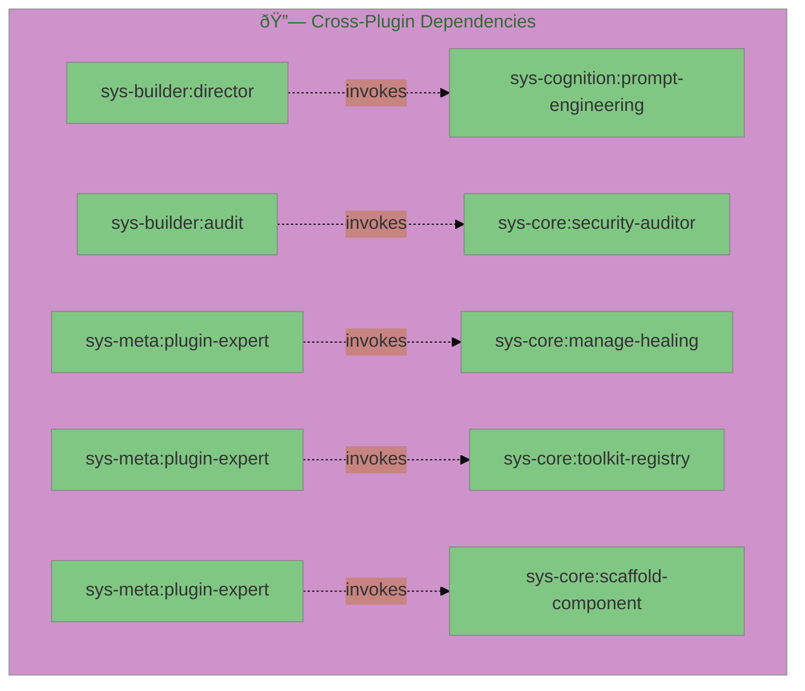

# Toolkit Architecture Analysis

Generated on: 2026-01-11 14:44:34

## Plugin Overview

```mermaid
%%{init: {"theme": "base", "themeVariables": {"primaryColor": "#ff6b6b"}}}%%
graph TB
    subgraph sys-builder ["🧩 sys-builder"]
        sys-builder_execution-core_skill["âš™ï¸ execution-core"]
        sys-builder_builder-core_skill["âš™ï¸ builder-core"]
        sys-builder_architecture_skill["âš™ï¸ architecture"]
        sys-builder_software-engineering_skill["âš™ï¸ software-engineering"]
        sys-builder_plan-execution_skill["âš™ï¸ plan-execution"]
        sys-builder_designer_agent["🤖 designer"]
        sys-builder_director_agent["🤖 director"]
        sys-builder_worker_agent["🤖 worker"]
        sys-builder_audit_command["âš¡ audit"]
        sys-builder_build_command["âš¡ build"]
        sys-builder_plan_command["âš¡ plan"]
    end
    subgraph sys-cognition ["🧩 sys-cognition"]
        sys-cognition_thinking-frameworks_skill["âš™ï¸ thinking-frameworks"]
        sys-cognition_prompt-engineering_skill["âš™ï¸ prompt-engineering"]
        sys-cognition_context-engineering_skill["âš™ï¸ context-engineering"]
        sys-cognition_deep-analysis_skill["âš™ï¸ deep-analysis"]
        sys-cognition_reasoner_agent["🤖 reasoner"]
        sys-cognition_think_command["âš¡ think"]
    end
    subgraph sys-core ["🧩 sys-core"]
        sys-core_audit-security_skill["âš™ï¸ audit-security"]
        sys-core_scaffold-component_skill["âš™ï¸ scaffold-component"]
        sys-core_validate-toolkit_skill["âš™ï¸ validate-toolkit"]
        sys-core_manage-healing_skill["âš™ï¸ manage-healing"]
        sys-core_toolkit-registry_skill["âš™ï¸ toolkit-registry"]
        sys-core_check-types_skill["âš™ï¸ check-types"]
        sys-core_security-auditor_agent["🤖 security-auditor"]
        sys-core_hooks_sys-core["📦 hooks"]
    end
    subgraph sys-edge ["🧩 sys-edge"]
        sys-edge_uv-ruff-python-tools_skill["âš™ï¸ uv-ruff-python-tools"]
        sys-edge_edge-ai-management_skill["âš™ï¸ edge-ai-management"]
        sys-edge_offline-sync_skill["âš™ï¸ offline-sync"]
        sys-edge_mobile-optimization_skill["âš™ï¸ mobile-optimization"]
        sys-edge_gitingest_skill["âš™ï¸ gitingest"]
    end
    subgraph sys-meta ["🧩 sys-meta"]
        sys-meta_meta-builder_skill["âš™ï¸ meta-builder"]
        sys-meta_plugin-expert_agent["🤖 plugin-expert"]
    end
    subgraph sys-multimodal ["🧩 sys-multimodal"]
        sys-multimodal_intent-translation_skill["âš™ï¸ intent-translation"]
        sys-multimodal_multimodal-understanding_skill["âš™ï¸ multimodal-understanding"]
        sys-multimodal_video-editor_agent["🤖 video-editor"]
    end
    subgraph sys-research ["🧩 sys-research"]
        sys-research_researcher_skill["âš™ï¸ researcher"]
        sys-research_deep-research_command["âš¡ deep-research"]
    end
    sys-builder_director_agent ==>|invokes| sys-cognition_prompt-engineering_skill
    sys-builder_audit_command ==>|invokes| sys-core_security-auditor_agent
    sys-meta_plugin-expert_agent ==>|invokes| sys-core_manage-healing_skill
    sys-meta_plugin-expert_agent ==>|invokes| sys-core_toolkit-registry_skill
    sys-meta_plugin-expert_agent ==>|invokes| sys-core_scaffold-component_skill
```

## Component Detail View

```mermaid
%%{init: {"theme": "base", "themeVariables": {"primaryColor": "#4fc3f7"}}}%%
graph LR
    title["Plugin Component Detail View"]

    subgraph SKILLs
        sys-research_researcher_skill["researcher\n(sys-research)\n📥0 → 📤0"]
        sys-multimodal_intent-translation_skill["intent-translation\n(sys-multimodal)\n📥0 → 📤0"]
        sys-multimodal_multimodal-understanding_skill["multimodal-understanding\n(sys-multimodal)\n📥0 → 📤0"]
        sys-builder_execution-core_skill["execution-core\n(sys-builder)\n📥0 → 📤0"]
        sys-builder_builder-core_skill["builder-core\n(sys-builder)\n📥7 → 📤0"]
        sys-builder_architecture_skill["architecture\n(sys-builder)\n📥0 → 📤0"]
        sys-builder_software-engineering_skill["software-engineering\n(sys-builder)\n📥0 → 📤0"]
        sys-builder_plan-execution_skill["plan-execution\n(sys-builder)\n📥1 → 📤0"]
        sys-cognition_thinking-frameworks_skill["thinking-frameworks\n(sys-cognition)\n📥0 → 📤0"]
        sys-cognition_prompt-engineering_skill["prompt-engineering\n(sys-cognition)\n📥0 → 📤0"]
        sys-cognition_context-engineering_skill["context-engineering\n(sys-cognition)\n📥0 → 📤0"]
        sys-cognition_deep-analysis_skill["deep-analysis\n(sys-cognition)\n📥0 → 📤0"]
        sys-core_audit-security_skill["audit-security\n(sys-core)\n📥0 → 📤0"]
        sys-core_scaffold-component_skill["scaffold-component\n(sys-core)\n📥0 → 📤0"]
        sys-core_validate-toolkit_skill["validate-toolkit\n(sys-core)\n📥0 → 📤0"]
        sys-core_manage-healing_skill["manage-healing\n(sys-core)\n📥0 → 📤0"]
        sys-core_toolkit-registry_skill["toolkit-registry\n(sys-core)\n📥0 → 📤0"]
        sys-core_check-types_skill["check-types\n(sys-core)\n📥0 → 📤0"]
        sys-meta_meta-builder_skill["meta-builder\n(sys-meta)\n📥0 → 📤0"]
        sys-edge_uv-ruff-python-tools_skill["uv-ruff-python-tools\n(sys-edge)\n📥0 → 📤0"]
        sys-edge_edge-ai-management_skill["edge-ai-management\n(sys-edge)\n📥0 → 📤0"]
        sys-edge_offline-sync_skill["offline-sync\n(sys-edge)\n📥0 → 📤0"]
        sys-edge_mobile-optimization_skill["mobile-optimization\n(sys-edge)\n📥0 → 📤0"]
        sys-edge_gitingest_skill["gitingest\n(sys-edge)\n📥0 → 📤0"]
    end

    subgraph AGENTs
        sys-multimodal_video-editor_agent["video-editor\n(sys-multimodal)\n📥2 → 📤0"]
        sys-builder_designer_agent["designer\n(sys-builder)\n📥3 → 📤0"]
        sys-builder_director_agent["director\n(sys-builder)\n📥4 → 📤0"]
        sys-builder_worker_agent["worker\n(sys-builder)\n📥3 → 📤0"]
        sys-cognition_reasoner_agent["reasoner\n(sys-cognition)\n📥1 → 📤0"]
        sys-core_security-auditor_agent["security-auditor\n(sys-core)\n📥0 → 📤0"]
        sys-meta_plugin-expert_agent["plugin-expert\n(sys-meta)\n📥4 → 📤0"]
    end

    subgraph COMMANDs
        sys-research_deep-research_command["deep-research\n(sys-research)\n📥0 → 📤0"]
        sys-builder_audit_command["audit\n(sys-builder)\n📥1 → 📤0"]
        sys-builder_build_command["build\n(sys-builder)\n📥1 → 📤0"]
        sys-builder_plan_command["plan\n(sys-builder)\n📥1 → 📤0"]
        sys-cognition_think_command["think\n(sys-cognition)\n📥1 → 📤0"]
    end
```

## Cross-Plugin Dependencies

```mermaid
%%{init: {"theme": "base", "themeVariables": {"primaryColor": "#81c784"}}}%%
graph TB
    subgraph DEPENDENCIES ["🔗 Cross-Plugin Dependencies"]
        DEP1["sys-builder:director"]
            -.->|invokes| DEP1_T["sys-cognition:prompt-engineering"]
        DEP2["sys-builder:audit"]
            -.->|invokes| DEP2_T["sys-core:security-auditor"]
        DEP3["sys-meta:plugin-expert"]
            -.->|invokes| DEP3_T["sys-core:manage-healing"]
        DEP4["sys-meta:plugin-expert"]
            -.->|invokes| DEP4_T["sys-core:toolkit-registry"]
        DEP5["sys-meta:plugin-expert"]
            -.->|invokes| DEP5_T["sys-core:scaffold-component"]
    end
```