# 🔍 Cat Toolkit Plugin Analysis Report

> **Generated:** 2026-01-11 11:19:24

## 📊 Statistics
- **Total Plugins:** 5
- **Total Components:** 33
- **Cross-Plugin Links:** 2

## 🧩 Plugin Overview

```mermaid
%%{init: {"theme": "base", "themeVariables": {"primaryColor": "#ff6b6b"}}}%%
graph TB
    subgraph sys-builder ["🧩 sys-builder"]
        sys-builder_execution-core_skill["⚙️ execution-core"]
        sys-builder_builder-core_skill["⚙️ builder-core"]
        sys-builder_architecture_skill["⚙️ architecture"]
        sys-builder_software-engineering_skill["⚙️ software-engineering"]
        sys-builder_plan-execution_skill["⚙️ plan-execution"]
        sys-builder_designer_agent["🤖 designer"]
        sys-builder_director_agent["🤖 director"]
        sys-builder_worker_agent["🤖 worker"]
        sys-builder_audit_command["⚡ audit"]
        sys-builder_build_command["⚡ build"]
        sys-builder_plan_command["⚡ plan"]
    end
    subgraph sys-cognition ["🧩 sys-cognition"]
        sys-cognition_thinking-frameworks_skill["⚙️ thinking-frameworks"]
        sys-cognition_prompt-engineering_skill["⚙️ prompt-engineering"]
        sys-cognition_context-engineering_skill["⚙️ context-engineering"]
        sys-cognition_deep-analysis_skill["⚙️ deep-analysis"]
        sys-cognition_reasoner_agent["🤖 reasoner"]
        sys-cognition_think_command["⚡ think"]
    end
    subgraph sys-core ["🧩 sys-core"]
        sys-core_audit-security_skill["⚙️ audit-security"]
        sys-core_scaffold-component_skill["⚙️ scaffold-component"]
        sys-core_validate-toolkit_skill["⚙️ validate-toolkit"]
        sys-core_meta-builder_skill["⚙️ meta-builder"]
        sys-core_manage-healing_skill["⚙️ manage-healing"]
        sys-core_toolkit-registry_skill["⚙️ toolkit-registry"]
        sys-core_check-types_skill["⚙️ check-types"]
        sys-core_plugin-expert_agent["🤖 plugin-expert"]
        sys-core_security-auditor_agent["🤖 security-auditor"]
    end
    subgraph sys-edge ["🧩 sys-edge"]
        sys-edge_uv-ruff-python-tools_skill["⚙️ uv-ruff-python-tools"]
        sys-edge_edge-ai-management_skill["⚙️ edge-ai-management"]
        sys-edge_offline-sync_skill["⚙️ offline-sync"]
        sys-edge_mobile-optimization_skill["⚙️ mobile-optimization"]
    end
    subgraph sys-multimodal ["🧩 sys-multimodal"]
        sys-multimodal_intent-translation_skill["⚙️ intent-translation"]
        sys-multimodal_multimodal-understanding_skill["⚙️ multimodal-understanding"]
        sys-multimodal_video-editor_agent["🤖 video-editor"]
    end
    sys-builder_director_agent -.->|references| sys-cognition_prompt-engineering_skill
    sys-builder_audit_command ==>|invokes| sys-core_security-auditor_agent

classDef skill fill:#e1f5fe
classDef agent fill:#f3e5f5
classDef command fill:#fff3e0

class sys-cognition_thinking-frameworks_skill skill
class sys-cognition_prompt-engineering_skill skill
class sys-cognition_context-engineering_skill skill
class sys-cognition_deep-analysis_skill skill
class sys-cognition_reasoner_agent agent
class sys-cognition_think_command command
class sys-core_audit-security_skill skill
class sys-core_scaffold-component_skill skill
class sys-core_validate-toolkit_skill skill
class sys-core_meta-builder_skill skill
class sys-core_manage-healing_skill skill
class sys-core_toolkit-registry_skill skill
class sys-core_check-types_skill skill
class sys-core_plugin-expert_agent agent
class sys-core_security-auditor_agent agent
class sys-builder_execution-core_skill skill
class sys-builder_builder-core_skill skill
class sys-builder_architecture_skill skill
class sys-builder_software-engineering_skill skill
class sys-builder_plan-execution_skill skill
class sys-builder_designer_agent agent
class sys-builder_director_agent agent
class sys-builder_worker_agent agent
class sys-builder_audit_command command
class sys-builder_build_command command
class sys-builder_plan_command command
class sys-multimodal_intent-translation_skill skill
class sys-multimodal_multimodal-understanding_skill skill
class sys-multimodal_video-editor_agent agent
class sys-edge_uv-ruff-python-tools_skill skill
class sys-edge_edge-ai-management_skill skill
class sys-edge_offline-sync_skill skill
class sys-edge_mobile-optimization_skill skill
```

## 🔗 Dependencies

```mermaid
%%{init: {"theme": "base", "themeVariables": {"primaryColor": "#81c784"}}}%%
graph TB
    subgraph DEPENDENCIES ["🔗 Cross-Plugin Dependencies"]
        DEP1["sys-builder:director"]
            -.->|references| DEP1_T["sys-cognition:prompt-engineering"]
        DEP2["sys-builder:audit"]
            -.->|invokes| DEP2_T["sys-core:security-auditor"]
    end

    DEPENDENCIES -.->|validate| CHECK["✅ Architecture Check"]
```

## ⚙️ Component Detail

```mermaid
%%{init: {"theme": "base", "themeVariables": {"primaryColor": "#4fc3f7"}}}%%
graph LR
    title["Plugin Component Detail View"]

    subgraph SKILLs
        skill_sys-cognition_thinking-frameworks["thinking-frameworks\n(sys-cognition)\n📥0 → 📤0"]
        skill_sys-cognition_prompt-engineering["prompt-engineering\n(sys-cognition)\n📥0 → 📤0"]
        skill_sys-cognition_context-engineering["context-engineering\n(sys-cognition)\n📥1 → 📤0"]
        skill_sys-cognition_deep-analysis["deep-analysis\n(sys-cognition)\n📥0 → 📤0"]
        skill_sys-core_audit-security["audit-security\n(sys-core)\n📥0 → 📤0"]
        skill_sys-core_scaffold-component["scaffold-component\n(sys-core)\n📥0 → 📤0"]
        skill_sys-core_validate-toolkit["validate-toolkit\n(sys-core)\n📥1 → 📤1"]
        skill_sys-core_meta-builder["meta-builder\n(sys-core)\n📥0 → 📤0"]
        skill_sys-core_manage-healing["manage-healing\n(sys-core)\n📥0 → 📤0"]
        skill_sys-core_toolkit-registry["toolkit-registry\n(sys-core)\n📥0 → 📤0"]
        skill_sys-core_check-types["check-types\n(sys-core)\n📥0 → 📤0"]
        skill_sys-builder_execution-core["execution-core\n(sys-builder)\n📥0 → 📤0"]
        skill_sys-builder_builder-core["builder-core\n(sys-builder)\n📥7 → 📤0"]
        skill_sys-builder_architecture["architecture\n(sys-builder)\n📥0 → 📤0"]
        skill_sys-builder_software-engineering["software-engineering\n(sys-builder)\n📥0 → 📤0"]
        skill_sys-builder_plan-execution["plan-execution\n(sys-builder)\n📥1 → 📤0"]
        skill_sys-multimodal_intent-translation["intent-translation\n(sys-multimodal)\n📥0 → 📤0"]
        skill_sys-multimodal_multimodal-understanding["multimodal-understanding\n(sys-multimodal)\n📥0 → 📤0"]
        skill_sys-edge_uv-ruff-python-tools["uv-ruff-python-tools\n(sys-edge)\n📥0 → 📤0"]
        skill_sys-edge_edge-ai-management["edge-ai-management\n(sys-edge)\n📥1 → 📤1"]
        skill_sys-edge_offline-sync["offline-sync\n(sys-edge)\n📥0 → 📤0"]
        skill_sys-edge_mobile-optimization["mobile-optimization\n(sys-edge)\n📥0 → 📤0"]
    end

    subgraph AGENTs
        agent_sys-cognition_reasoner["reasoner\n(sys-cognition)\n📥1 → 📤1"]
        agent_sys-core_plugin-expert["plugin-expert\n(sys-core)\n📥4 → 📤4"]
        agent_sys-core_security-auditor["security-auditor\n(sys-core)\n📥0 → 📤0"]
        agent_sys-builder_designer["designer\n(sys-builder)\n📥3 → 📤3"]
        agent_sys-builder_director["director\n(sys-builder)\n📥4 → 📤3"]
        agent_sys-builder_worker["worker\n(sys-builder)\n📥3 → 📤3"]
        agent_sys-multimodal_video-editor["video-editor\n(sys-multimodal)\n📥2 → 📤2"]
    end

    subgraph COMMANDs
        command_sys-cognition_think["think\n(sys-cognition)\n📥1 → 📤1"]
        command_sys-builder_audit["audit\n(sys-builder)\n📥2 → 📤0"]
        command_sys-builder_build["build\n(sys-builder)\n📥1 → 📤1"]
        command_sys-builder_plan["plan\n(sys-builder)\n📥1 → 📤1"]
    end
    agent_sys-builder_director -->|uses| skill_sys-cognition_prompt-engineering
    command_sys-builder_audit -->|uses| agent_sys-core_security-auditor
```

## 🪝 Hook System

## ✅ Validation

```mermaid
%%{init: {"theme": "base", "themeVariables": {"primaryColor": "#e57373"}}}%%
graph TD
    START([Start Analysis])
    DISCOVER[Discover Plugins]
    PARSE[Parse Components]
    EXTRACT[Extract Relationships]
    VALIDATE{Validation}
    ERRORS[❌ Issues Found]
    ERRORS --> REPORT
    REPORT[Generate Reports]
    GRAPHS[Create Mermaid Graphs]
    END([End])
    START --> DISCOVER
    DISCOVER --> PARSE
    PARSE --> EXTRACT
    EXTRACT --> VALIDATE
    VALIDATE -->|Issues| ERRORS
    VALIDATE -->|No Issues| PASSED
    ERRORS --> REPORT
    PASSED --> REPORT
    REPORT --> GRAPHS
    GRAPHS --> END
```

## 📋 Validation Details

### ⚠️ Issues Found

- **[ERROR]** broken_reference
  - Component: `sys-cognition:context-engineering:skill`
  - Reference: `external:sys-core:hooks`
- **[ERROR]** broken_reference
  - Component: `sys-builder:builder-core:skill`
  - Reference: `external:templates:summary`
- **[ERROR]** broken_reference
  - Component: `sys-builder:builder-core:skill`
  - Reference: `external:templates:issues`
- **[ERROR]** broken_reference
  - Component: `sys-builder:builder-core:skill`
  - Reference: `external:templates:roadmap`
- **[ERROR]** broken_reference
  - Component: `sys-builder:builder-core:skill`
  - Reference: `external:templates:phase-plan`
- **[ERROR]** broken_reference
  - Component: `sys-builder:builder-core:skill`
  - Reference: `external:templates:brief`
- **[ERROR]** broken_reference
  - Component: `sys-builder:builder-core:skill`
  - Reference: `external:templates:handoff`
- **[ERROR]** broken_reference
  - Component: `sys-builder:builder-core:skill`
  - Reference: `external:templates:discovery`
- **[ERROR]** broken_reference
  - Component: `sys-builder:plan-execution:skill`
  - Reference: `external:templates:summary`
