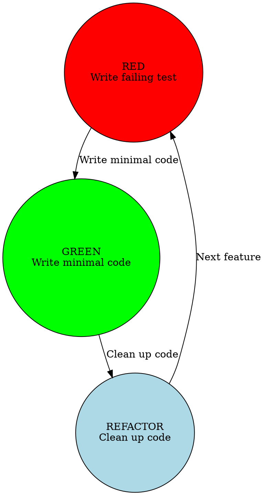

# Test-Driven Development Protocol

## The Iron Law

**NO PRODUCTION CODE WITHOUT A FAILING TEST FIRST**

Write code before the test? Delete it. Start over.

**No exceptions:**
- Don't keep it as "reference"
- Don't "adapt" it while writing tests
- Don't look at it
- Delete means delete

Implement fresh from tests. Period.

## Red-Green-Refactor Cycle



### RED Phase: Write a Failing Test

1. **Write a test for the next piece of functionality**
   - Be specific about what you're testing
   - Test one thing at a time
   - Make it fail (it should - the feature doesn't exist yet)

2. **Run the test to verify it fails**
   - If it doesn't fail, your test isn't testing anything
   - Fix the test before proceeding
   - Watch it fail for the right reason

3. **Only when the test fails for the right reason can you proceed**

### GREEN Phase: Write Minimal Code

1. **Write the minimal code to make the test pass**
   - Don't write extra code
   - Don't write "better" code
   - Just enough to pass the test

2. **Run the test to verify it passes**
   - If it doesn't pass, adjust the implementation
   - Keep it simple
   - Only do what the test requires

3. **Your code is allowed to be ugly at this point**

### REFACTOR Phase: Clean Up

1. **Now you can improve the code**
   - Clean up naming
   - Remove duplication
   - Improve structure
   - But ONLY while tests pass

2. **Run tests to verify refactoring doesn't break anything**
   - Tests are your safety net
   - If refactoring breaks tests, undo it

3. **Commit after successful refactoring**

## Test Writing Guidelines

### AAA Pattern

```
Arrange: Set up the test data and environment
Act: Execute the code under test
Assert: Verify the result
```

### Good Tests Are:

1. **Independent** - Don't rely on other tests
2. **Repeatable** - Run multiple times, same result
3. **Fast** - Complete in milliseconds
4. **Specific** - Test one thing at a time
5. **Clear** - Easy to understand what they're testing

### Test Naming

```python
def test_specific_behavior():
    """Test should describe WHAT is being tested"""

# Good examples:
def test_add_two_positive_numbers():
def test_user_cannot_checkout_with_empty_cart():
def test_parser_handles_empty_input():
def test_database_connection_retry_on_failure():
```

## Red Flags

**Never:**
- Write implementation code before tests
- Keep implementation code as "reference" when writing tests
- Look at existing implementation while writing tests
- Write tests that don't fail initially
- Skip tests because "it's obvious"
- Write multiple tests that all pass immediately
- Skip the refactoring phase

**If you accidentally write implementation first:**
- DELETE IT ALL
- Start over with tests
- No exceptions

**If tests don't fail initially:**
- Check if test is actually testing what you think
- Verify the feature doesn't already exist
- Fix the test before proceeding

**If you can't write a test:**
- The feature is too big (break it down)
- You don't understand the requirement (ask questions)
- The design is unclear (sketch it out first)

## Implementation Patterns

### For New Features

```
1. Write test for the feature
2. Run test → fails (RED)
3. Write minimal implementation
4. Run test → passes (GREEN)
5. Refactor code (REFACTOR)
6. Repeat for next feature
```

### For Bug Fixes

```
1. Write test that reproduces the bug
2. Run test → fails (RED)
3. Fix the bug with minimal change
4. Run test → passes (GREEN)
5. Refactor if needed (REFACTOR)
6. Verify no regressions with existing tests
```

### For Refactoring

```
1. Write tests for current behavior (if missing)
2. Run tests → all pass (GREEN)
3. Refactor code
4. Run tests → still pass (REFACTOR)
5. If tests fail, undo refactoring
```

## Benefits of TDD

1. **Better Design** - Tests force you to think about API first
2. **Fewer Bugs** - Code is verified from day one
3. **Living Documentation** - Tests show how code works
4. **Confidence** - Fearless refactoring with test safety net
5. **Less Debugging** - Find issues immediately
6. **Cleaner Code** - Minimal code that does exactly what's needed
