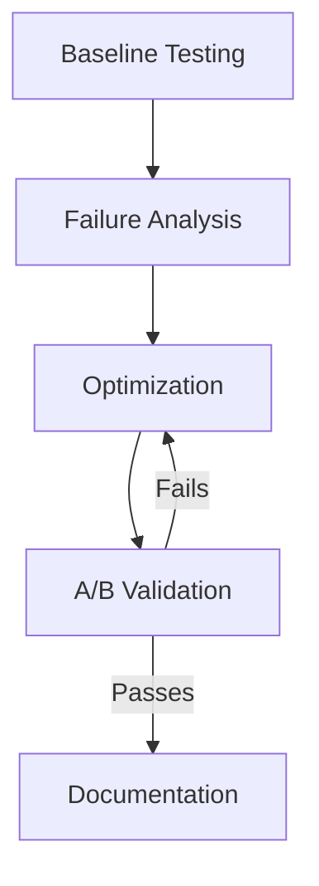

# Systematic Prompt Optimization

The iterative process for refining prompts to meet production-level quality standards.

## The Optimization Workflow



### 1. Baseline Testing
Establish how your prompt currently performs using a diverse test set.
- **Test Set**: Simple cases, edge cases, complex cases, ambiguous inputs.
- **Metrics**: Accuracy, format compliance, completeness, consistency.

### 2. Failure Analysis
Categorize why the prompt failed:
- **Format Errors**: Wrong structure.
- **Incomplete**: Missing info.
- **Hallucination**: Incorrect info.
- **Verbosity**: Too much noise.

### 3. Optimization Strategies

| Failure Mode | Recommended Fix |
|:---|:---|
| **Formatting Issues** | Add `<output_format>` and 2-3 examples. |
| **Incompleteness** | Add a `Requirement Checklist` in markdown. |
| **Wrong Info** | Add `<thinking>` for CoT and a `Verification` step. |
| **Off-Topic** | Define clear `<constraints>` (Negative constraints). |
| **Inconsistency** | Increase example count (Few-shot) and diversity. |

### 4. A/B Validation
Test the optimized version against the baseline using the *same* inputs.
- Only keep changes that demonstrably improve metrics.
- Be careful of "over-fitting" to one specific test case.

## Advanced Techniques

### Quality Gates
Add a checklist *inside the prompt* that the AI must verify before outputting.
```markdown
## Quality Gate
Before responding, ensure:
1. All security vulnerabilities are identified.
2. Remediation steps are provided for each.
3. Severity levels follow the [defined scale].
```

### Constraint Weighting
Use strong language (MUST, NEVER, ALWAYS) for critical constraints and more flexible language for style preferences.

## Version Control
Always version your prompts and maintain a changelog of what was optimized.
- **v1.0**: Baseline.
- **v1.1**: Added few-shot examples (Fixed format).
- **v1.2**: Added quality gates (Fixed completeness).

## Diminishing Returns
Stop optimizing when:
- Success rate meets the target (usually >90%).
- Diminishing returns make further effort inefficient.
- The prompt becomes so verbose it hits token limits or loses focus.
